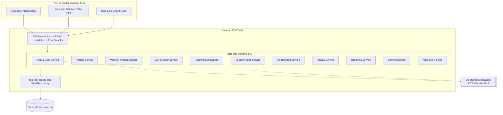
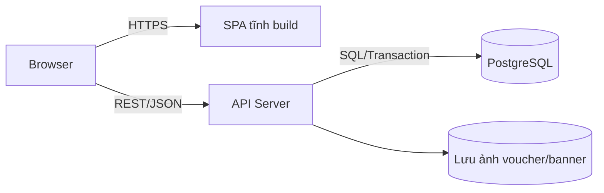
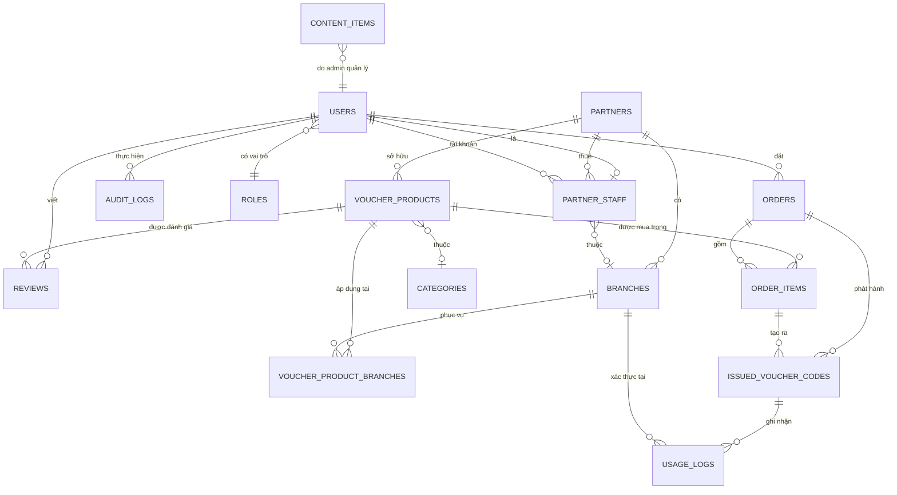
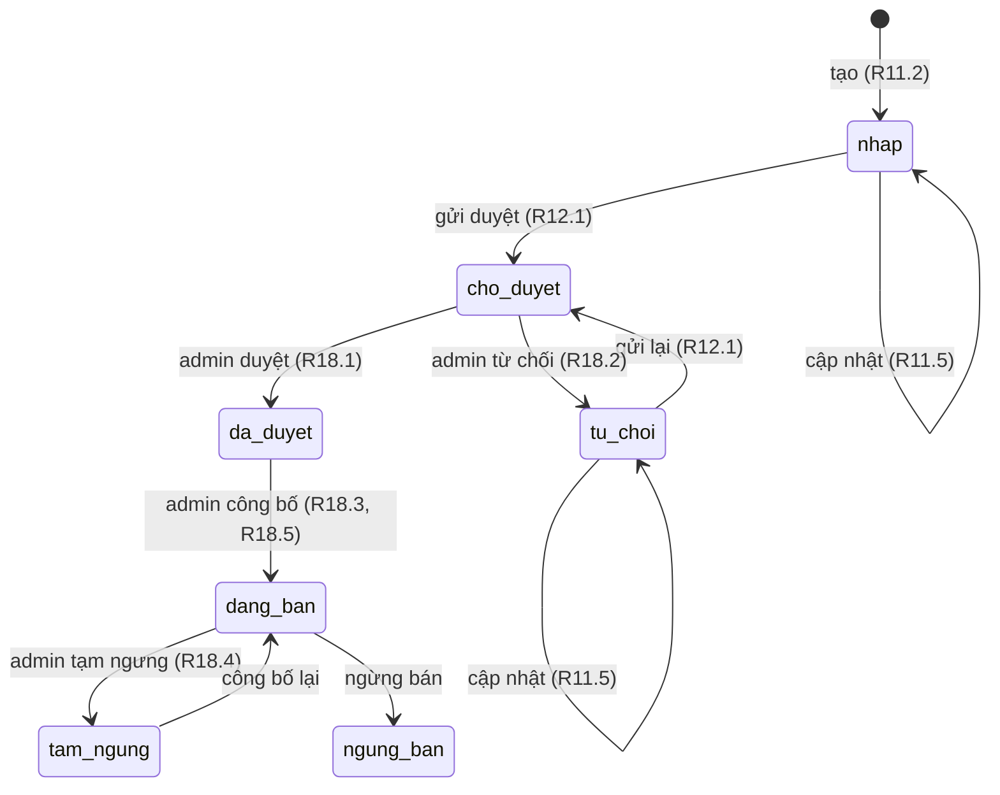
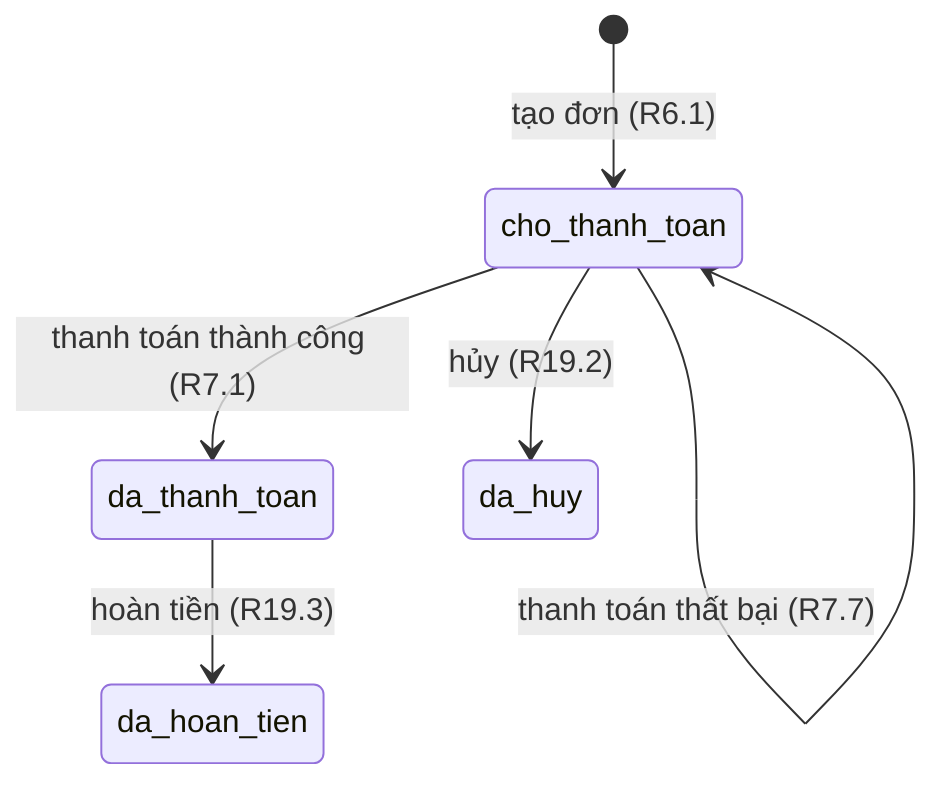
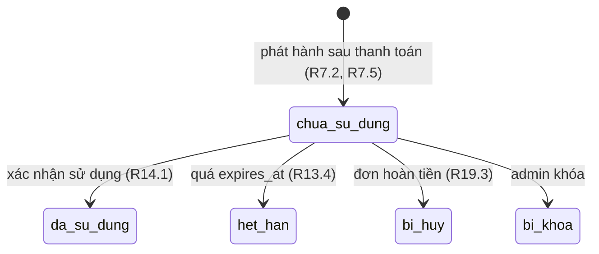
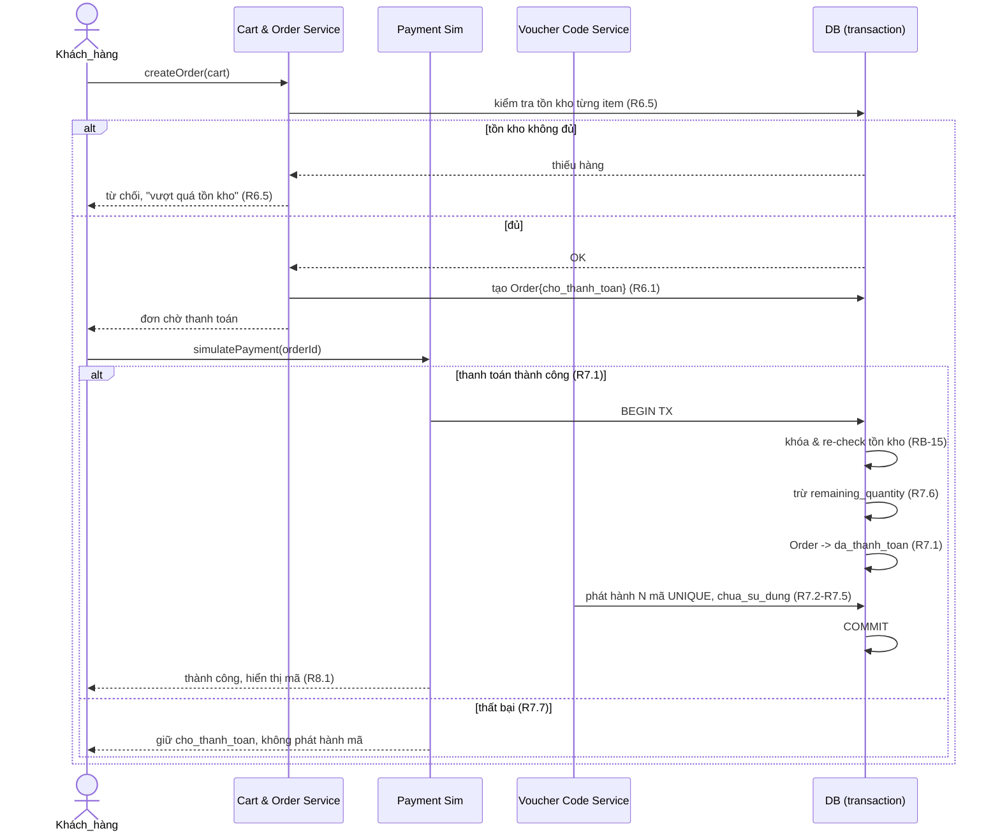

# Design Document

## Overview

Tài liệu thiết kế này mô tả kiến trúc và giải pháp kỹ thuật cho **Hệ thống Thương mại điện tử bán Voucher giảm giá trực tuyến** (Hệ_thống), dựa trên tài liệu yêu cầu đã được duyệt (`requirements.md`) và BRD phiên bản 1.0.

Hệ_thống là một sàn trung gian ba vai trò (Khách_hàng, Đối_tác bao gồm Nhân_viên_đối_tác, và Quản_trị_viên) hỗ trợ trọn vòng đời nghiệp vụ:

> Đăng ký đối tác → Duyệt đối tác → Tạo voucher → Duyệt voucher → Công bố bán → Khách mua → Thanh toán mô phỏng → Phát hành mã voucher duy nhất → Sử dụng/Xác thực → Báo cáo.

### Mục tiêu thiết kế chính

| Mục tiêu | Yêu cầu liên quan | Cách giải quyết trong thiết kế |
| --- | --- | --- |
| Bảo đảm mã voucher duy nhất và khó đoán | R7.3, R7.4 (RB-06) | Sinh mã ngẫu nhiên CSPRNG ≥ 12 ký tự + ràng buộc UNIQUE ở DB |
| Không phát hành mã trước khi thanh toán | R7.2, R7.7, R7.8 (RB-05) | Phát hành mã trong cùng transaction với chuyển trạng thái `đã thanh toán` |
| Không bán vượt tồn kho (oversell) | R5.5, R6.5, R7.6 (RB-11, RB-15) | Kiểm tra + trừ tồn kho nguyên tử (atomic) bằng khóa hàng/điều kiện |
| Không tái sử dụng mã đã dùng | R14.1–R14.3 (RB-07, RB-08) | Máy trạng thái Voucher_code + transaction xác nhận sử dụng |
| Phân quyền theo vai trò (RBAC) | R16.5, R20.2, R22.3, R23 | Middleware RBAC + kiểm tra phạm vi sở hữu (ownership/scope) |
| Bảo vệ dữ liệu nhạy cảm | R1.4, R7.8 (NFR-02) | Băm mật khẩu (bcrypt/argon2), không trả Voucher_code khi chưa thanh toán |
| Toàn vẹn dữ liệu qua các trạng thái | R7, R14, R18, R19 (KPI-02) | Ba máy trạng thái tường minh + transaction ACID |

### Phạm vi mô phỏng (theo ASM-01..04)

- **Thanh_toán_mô_phỏng**: một dịch vụ nội bộ trả về kết quả thành công/thất bại, không gọi cổng thanh toán thật.
- **OTP / Email / SMS**: thể hiện bằng thông báo trong Hệ_thống (in-app notification) và bản ghi log, không gửi ra ngoài.
- **QR_mô_phỏng**: sinh ảnh QR mã hóa Voucher_code hoặc cho phép nhập mã thủ công.

## Architecture

### Kiến trúc tổng thể

Hệ_thống dùng kiến trúc **client–server nhiều tầng (layered)** với một ứng dụng web SPA (responsive) gọi tới một REST API backend, backend giao tiếp với một cơ sở dữ liệu quan hệ (CON-02, R24.2). Logic nghiệp vụ được tách thành các module dịch vụ (service) theo miền nghiệp vụ.



### Tầng kiến trúc

| Tầng | Trách nhiệm |
| --- | --- |
| **Presentation (SPA)** | Giao diện responsive cho 3 vai trò; render danh sách/chi tiết voucher, giỏ hàng, dashboard. Không chứa logic nghiệp vụ nhạy cảm. |
| **API / Controller** | Định tuyến HTTP, xác thực đầu vào (validation), ánh xạ request → service. |
| **Middleware** | Xác thực phiên (session/JWT), RBAC, kiểm tra phạm vi sở hữu, xử lý lỗi tập trung, ghi audit. |
| **Service (Domain)** | Logic nghiệp vụ thuần: máy trạng thái, kiểm tra tồn kho, phát hành mã, xác thực voucher. Đây là nơi tập trung các thuộc tính đúng đắn (property). |
| **Repository / ORM** | Truy vấn và giao dịch (transaction) với DB quan hệ. |
| **Database** | Lưu trữ bền vững toàn bộ dữ liệu nghiệp vụ (R24.2). |

### Đề xuất ngăn xếp công nghệ (Technology Stack)

Lựa chọn dưới đây phù hợp với đồ án sinh viên: tài liệu phong phú, dễ học, hỗ trợ tốt cả RBAC, transaction quan hệ và property-based testing.

| Thành phần | Đề xuất chính | Lý do | Phương án thay thế |
| --- | --- | --- | --- |
| Ngôn ngữ | **TypeScript (Node.js)** | Một ngôn ngữ cho cả FE/BE, gõ tĩnh giúp giảm lỗi, cộng đồng lớn | Java (Spring Boot), PHP (Laravel), Python (Django) |
| Backend framework | **Express** | Nhẹ, linh hoạt, middleware rõ ràng cho Auth/RBAC/validation/error handler; dễ học cho đồ án | NestJS, Spring Boot, Laravel |
| Cơ sở dữ liệu | **PostgreSQL** (quan hệ) | Giao dịch ACID mạnh, hỗ trợ khóa hàng giúp chống oversell | MySQL/MariaDB |
| ORM / truy cập DB | **Prisma** (hoặc TypeORM) | Migration rõ ràng, type-safe, dễ viết transaction | TypeORM, Sequelize |
| Frontend | **React + Vite** | SPA responsive, hệ sinh thái lớn | Next.js, Vue |
| Xác thực | **JWT + bcrypt/argon2** | Phiên không trạng thái, băm mật khẩu an toàn (R1.4) | Session cookie + Redis |
| Sinh mã ngẫu nhiên | **`crypto.randomBytes`** (CSPRNG) | Mã khó đoán theo R7.4 | Java `SecureRandom`, PHP `random_bytes` |
| Kiểm thử đơn vị | **Vitest / Jest** | Phổ biến, tích hợp tốt | Mocha |
| Property-based testing | **fast-check** | Thư viện PBT hàng đầu cho TS/JS | jqwik (Java), Hypothesis (Python) |

> Lưu ý: thiết kế độc lập với công nghệ cụ thể; mọi ràng buộc đúng đắn (tính duy nhất, transaction, RBAC) đều có thể hiện thực trên các ngăn xếp thay thế tương đương.

### Mô hình triển khai (demo)



## Components and Interfaces

Mỗi service đóng gói một miền nghiệp vụ và là nơi đặt logic kiểm thử được. Các quy tắc RBAC (R23) áp dụng xuyên suốt thông qua middleware trước khi tới service.

### 1. Auth & User Service
**Trách nhiệm:** Đăng ký, đăng nhập/đăng xuất, quên/đổi mật khẩu, quản lý hồ sơ, quản lý phiên; băm mật khẩu. Quản trị: tra cứu, khóa/mở khóa, đổi vai trò người dùng.
**Yêu cầu:** R1, R2, R16.
**Giao diện chính:**
- `register(email|phone, password, profile) -> User` (R1.1–R1.5)
- `login(identifier, password) -> Session` (R2.1–R2.3)
- `logout(session)` (R2.4)
- `requestPasswordReset(identifier)` / `changePassword(userId, current, new)` (R2.5, R2.6)
- `updateProfile(userId, profile)` (R2.7)
- `adminSearchUsers(criteria)`, `lockUser(id)`, `unlockUser(id)`, `changeRole(id, role)` (R16)

### 2. Partner Service
**Trách nhiệm:** Đăng ký hồ sơ Đối_tác, cập nhật thông tin pháp lý/người đại diện, quản lý Chi_nhánh, quản lý Nhân_viên_đối_tác. Quản trị: duyệt/từ chối/khóa/mở khóa Đối_tác.
**Yêu cầu:** R10, R17.
**Giao diện chính:**
- `registerPartner(legalInfo, representative) -> Partner{status=chờ duyệt}` (R10.1, R10.5)
- `updatePartnerProfile(...)`, `manageBranch(add|update|delete)` (R10.3, R10.4)
- `approvePartner(id)`, `rejectPartner(id, reason)`, `lockPartner(id)`, `unlockPartner(id)` (R17.1–R17.4)

### 3. Voucher Product Service
**Trách nhiệm:** Tạo/cập nhật voucher sản phẩm, kiểm tra ràng buộc giá và thời gian, gửi duyệt, theo dõi số liệu (đã bán/đã dùng/hết hạn). Quản trị: duyệt/từ chối/công bố/tạm ngưng. Quản lý **máy trạng thái voucher sản phẩm**.
**Yêu cầu:** R11, R12, R18.
**Giao diện chính:**
- `createVoucher(partnerId, data) -> Voucher{status=nháp}` (R11.1, R11.2)
- `updateVoucher(voucherId, data)` chỉ khi `nháp|từ chối` (R11.5)
- `submitForApproval(voucherId)` (R12.1, R12.3)
- `approve(voucherId)`, `reject(voucherId, reason)`, `publish(voucherId)`, `suspend(voucherId)` (R18)
- `getPartnerVoucherStats(partnerId)` (R11.6)

### 4. Cart & Order Service
**Trách nhiệm:** Quản lý Giỏ_hàng, tính tổng tạm tính, tạo Đơn_hàng, kiểm tra tồn kho tại thời điểm đặt mua, lưu thông tin quà tặng. Quản lý **máy trạng thái đơn hàng**. Quản trị: tra cứu/hủy/hoàn tiền đơn.
**Yêu cầu:** R5, R6, R19.
**Giao diện chính:**
- `addToCart`, `updateQty`, `removeItem`, `getSubtotal` (R5.1–R5.4)
- `createOrder(customerId, cart, paymentMethod, giftInfo?) -> Order{status=chờ thanh toán}` (R6.1–R6.5)
- `adminSearchOrders`, `cancelOrder(id)`, `refundOrder(id)` (R19)

### 5. Payment Sim Service
**Trách nhiệm:** Mô phỏng thanh toán; báo thành công/thất bại; kích hoạt phát hành mã khi thành công.
**Yêu cầu:** R7.1, R7.7 (ASM-01).
**Giao diện chính:**
- `simulatePayment(orderId, outcome) -> PaymentResult`

### 6. Voucher Code Service (Issuance)
**Trách nhiệm:** Phát hành Voucher_code duy nhất, khó đoán; khởi tạo trạng thái và hạn dùng; trừ tồn kho; bảo đảm không lộ mã trước thanh toán. Quản lý **máy trạng thái voucher code**.
**Yêu cầu:** R7.2–R7.6, R7.8, R8.
**Giao diện chính:**
- `issueCodesForOrder(orderId)` — chạy trong transaction cùng việc chuyển đơn sang `đã thanh toán` (R7.2, R7.6)
- `generateUniqueCode() -> string(≥12, CSPRNG)` (R7.3, R7.4)
- `getCustomerOrderCodes(customerId, orderId)` — chỉ trả mã của đơn đã thanh toán thuộc chính khách (R8.1, R8.3, R7.8)

### 7. Redemption Service (Validation & Use)
**Trách nhiệm:** Kiểm tra (validate) và xác nhận sử dụng Voucher_code; kiểm tra phạm vi Đối_tác/Chi_nhánh; xử lý voucher nhiều lượt; ghi Nhật_ký_sử_dụng.
**Yêu cầu:** R13, R14.
**Giao diện chính:**
- `validateCode(actorPartnerId, code) -> CodeStatus` (R13.1–R13.4)
- `redeemCode(actorPartnerId, branchId, code) -> RedeemResult` (R14.1–R14.5)

### 8. Review Service
**Trách nhiệm:** Gửi đánh giá (sao 1–5) và phản hồi/khiếu nại; kiểm tra điều kiện đã mua/đã dùng.
**Yêu cầu:** R9.

### 9. Reporting & Dashboard Service
**Trách nhiệm:** Báo cáo Đối_tác (phạm vi sở hữu) và dashboard quản trị (toàn hệ thống).
**Yêu cầu:** R15, R21.

### 10. Content Service
**Trách nhiệm:** CRUD danh mục, banner, bài viết, popup, chính sách (chỉ Quản_trị_viên).
**Yêu cầu:** R20.

### 11. Audit Log Service
**Trách nhiệm:** Ghi Nhật_ký_hệ_thống cho thao tác quản trị quan trọng; tra cứu nhật ký (chỉ Quản_trị_viên).
**Yêu cầu:** R22.

### Ma trận phân quyền (RBAC) — R23

| Chức năng | Khách_hàng | Đối_tác | Nhân_viên_đối_tác | Quản_trị_viên |
| --- | --- | --- | --- | --- |
| Mua voucher, giỏ hàng, đơn hàng của mình | ✅ | ❌ | ❌ | ❌ |
| Xem Voucher_code của đơn mình | ✅ | ❌ | ❌ | ❌ |
| Tạo/quản lý voucher (phạm vi của mình) | ❌ | ✅ | ❌ | ❌ |
| Kiểm tra & xác nhận sử dụng voucher (phạm vi của mình) | ❌ | ✅ | ✅ | ❌ |
| Báo cáo đối tác (phạm vi của mình) | ❌ | ✅ | ❌ | ❌ |
| Quản lý người dùng / đối tác / duyệt voucher / đơn hàng | ❌ | ❌ | ❌ | ✅ |
| Quản lý nội dung, dashboard, nhật ký hệ thống | ❌ | ❌ | ❌ | ✅ |

## Data Models

Hệ_thống dùng cơ sở dữ liệu quan hệ (R24.2). Dưới đây là mô hình thực thể–quan hệ (ERD) và mô tả các bảng chính.

### ERD



### Mô tả bảng

**ROLES** (R24.5, R23) — vai trò RBAC
| Cột | Kiểu | Ghi chú |
| --- | --- | --- |
| id | PK | |
| name | enum | `KHACH_HANG`, `DOI_TAC`, `NHAN_VIEN_DOI_TAC`, `QUAN_TRI_VIEN` |

**USERS** (R1, R2, R16; DR-01)
| Cột | Kiểu | Ghi chú |
| --- | --- | --- |
| id | PK | |
| email | string, unique nullable | R1.2 |
| phone | string, unique nullable | R1.2 (ít nhất email hoặc phone) |
| password_hash | string | R1.4 — chỉ lưu băm |
| role_id | FK→ROLES | R16.4 |
| status | enum | `hoat_dong`, `bi_khoa` (R2.3, R16.2/3) |
| profile fields | … | họ tên, địa chỉ… (R2.7) |
| created_at / updated_at | timestamp | |

**PARTNERS** (R10, R17; DR-02)
| Cột | Kiểu | Ghi chú |
| --- | --- | --- |
| id | PK | |
| owner_user_id | FK→USERS | tài khoản đại diện chính |
| legal_name, tax_code, representative… | string | R10.1, R10.5 |
| approval_status | enum | `cho_duyet`, `da_duyet`, `tu_choi` (R10.1, R17.1/2) |
| reject_reason | string nullable | R17.2 |
| operating_status | enum | `hoat_dong`, `bi_khoa` (R17.3/4) |

**BRANCHES** (R10.4, R17.5)
| Cột | Kiểu | Ghi chú |
| --- | --- | --- |
| id | PK | |
| partner_id | FK→PARTNERS | |
| name, address, region | string | dùng cho lọc khu vực (R3.2) |

**PARTNER_STAFF** (Nhân_viên_đối_tác; R13, R14)
| Cột | Kiểu | Ghi chú |
| --- | --- | --- |
| id | PK | |
| user_id | FK→USERS | |
| partner_id | FK→PARTNERS | phạm vi xác thực |
| branch_id | FK→BRANCHES nullable | giới hạn theo chi nhánh |

**CATEGORIES** (R3.2, R20)
| id PK | name | parent_id nullable |

**VOUCHER_PRODUCTS** (R11, R18; DR-03)
| Cột | Kiểu | Ghi chú |
| --- | --- | --- |
| id | PK | |
| partner_id | FK→PARTNERS | R11.7 phạm vi sở hữu |
| category_id | FK→CATEGORIES nullable | |
| name, description, image_url | | R4.1 |
| original_price | decimal | giá gốc |
| sale_price | decimal | R11.3: phải < original_price |
| sale_start, sale_end | timestamp | R11.4, RB-03/04 |
| usage_start, usage_end | timestamp | hạn sử dụng → hạn của code (R7.5) |
| total_quantity | int | số lượng phát hành (RB-11) |
| remaining_quantity | int | tồn kho còn lại (R5.5, R6.5, R7.6) |
| is_multi_use | bool | voucher nhiều lượt (R14.5) |
| uses_per_code | int nullable | số lượt nếu multi-use |
| status | enum | `nhap`, `cho_duyet`, `da_duyet`, `tu_choi`, `dang_ban`, `tam_ngung`, `ngung_ban` |
| reject_reason | string nullable | R18.2 |

**VOUCHER_PRODUCT_BRANCHES** (nhiều–nhiều; R11.1, R4.1)
| voucher_product_id FK | branch_id FK |

**ORDERS** (R6, R7, R19; DR-04)
| Cột | Kiểu | Ghi chú |
| --- | --- | --- |
| id | PK | |
| customer_id | FK→USERS | R8.3 phạm vi sở hữu |
| total_amount | decimal | R6.1 |
| payment_method | enum | Thanh_toán_mô_phỏng (R6.3) |
| status | enum | `cho_thanh_toan`, `da_thanh_toan`, `da_huy`, `da_hoan_tien` |
| gift_recipient | json nullable | R6.2 |
| created_at | timestamp | |

**ORDER_ITEMS** (R6.1)
| Cột | Kiểu | Ghi chú |
| --- | --- | --- |
| id | PK | |
| order_id | FK→ORDERS | |
| voucher_product_id | FK→VOUCHER_PRODUCTS | |
| quantity | int | |
| unit_price | decimal | snapshot giá bán lúc đặt |

**ISSUED_VOUCHER_CODES** (R7, R8, R14; DR-05)
| Cột | Kiểu | Ghi chú |
| --- | --- | --- |
| id | PK | |
| code | string, **UNIQUE**, ≥12 ký tự | R7.3, R7.4 |
| order_id | FK→ORDERS | R8.3 |
| order_item_id | FK→ORDER_ITEMS | |
| voucher_product_id | FK→VOUCHER_PRODUCTS | R13.3 phạm vi đối tác |
| owner_user_id | FK→USERS | |
| status | enum | `chua_su_dung`, `da_su_dung`, `het_han`, `bi_huy`, `bi_khoa` |
| remaining_uses | int | cho multi-use (R14.5) |
| issued_at | timestamp | R7.5 |
| expires_at | timestamp | từ usage_end của voucher (R7.5, R13.4) |

**USAGE_LOGS** (Nhật_ký_sử_dụng; R14.1, R14.5)
| id PK | issued_code_id FK | branch_id FK | actor_user_id FK | used_at | result |

**REVIEWS** (R9; DR-06)
| id PK | customer_id FK | voucher_product_id FK | stars (1–5) | comment | type (`danh_gia`/`phan_hoi`/`khieu_nai`) | order_id FK nullable |

**AUDIT_LOGS** (Nhật_ký_hệ_thống; R22)
| id PK | actor_user_id FK | action | target_type | target_id | timestamp | detail json |

**CONTENT_ITEMS** (R20)
| id PK | type (`danh_muc`/`banner`/`bai_viet`/`popup`/`chinh_sach`) | payload json | updated_by FK | updated_at |

### Máy trạng thái (State Machines)

Ba máy trạng thái là trung tâm bảo đảm tính nhất quán (KPI-02). Mọi chuyển trạng thái không hợp lệ phải bị từ chối.

**Máy trạng thái Voucher sản phẩm** (R11.2, R12.1, R18)



**Máy trạng thái Đơn hàng** (R6.1, R7.1, R19)



**Máy trạng thái Voucher code** (R7.5, R14, R19.3)



### Luồng nghiệp vụ then chốt

**Mua → Thanh toán → Phát hành mã** (R6, R7) — thực hiện trong một transaction nguyên tử để chống oversell và bảo đảm chỉ phát hành sau thanh toán:



**Xác thực & Sử dụng voucher** (R13, R14):

```mermaid
sequenceDiagram
    actor NV as Đối_tác / Nhân_viên
    participant RED as Redemption Service
    participant DB as DB (transaction)

    NV->>RED: validateCode(code) (R13.1)
    RED->>DB: tìm code
    alt không tồn tại
        RED-->>NV: "mã không hợp lệ" (R13.2)
    else thuộc đối tác khác
        RED-->>NV: "ngoài phạm vi" (R13.3)
    else hợp lệ
        RED-->>NV: hiển thị trạng thái + thông tin (R13.4)
        NV->>RED: redeemCode(branch, code) (R14.1)
        RED->>DB: BEGIN TX
        alt code chua_su_dung & trong hạn & đúng phạm vi
            alt multi-use & remaining_uses>1
                DB->>DB: remaining_uses-- ; ghi USAGE_LOG (R14.5)
            else
                DB->>DB: status->da_su_dung ; ghi USAGE_LOG (R14.1)
            end
            DB->>DB: COMMIT
            RED-->>NV: xác nhận thành công
        else đã dùng / hết hạn / bị hủy / bị khóa / ngoài phạm vi
            DB->>DB: ROLLBACK
            RED-->>NV: từ chối kèm lý do (R14.2-R14.4)
        end
    end
```

## Correctness Properties

*Một property (thuộc tính đúng đắn) là một đặc tính hoặc hành vi phải luôn đúng trên mọi lần thực thi hợp lệ của hệ thống — về bản chất là một phát biểu hình thức về điều hệ thống phải làm. Các property là cầu nối giữa đặc tả con người đọc được và bảo đảm đúng đắn mà máy có thể kiểm chứng.*

Các property dưới đây được suy ra từ phần prework phân tích tiêu chí chấp nhận. Mỗi property là một phát biểu lượng từ phổ quát ("với mọi/với bất kỳ") và sẽ được hiện thực bằng property-based testing. Tập property tập trung vào các bất biến nghiệp vụ giá trị cao và các rủi ro RISK-01..04.

### Property 1: Tính duy nhất của Voucher_code
*Với bất kỳ* chuỗi đơn hàng được thanh toán thành công (số lượng, số đơn vị tùy ý), tập tất cả Voucher_code đã phát hành trong toàn Hệ_thống không bao giờ chứa hai mã trùng nhau.

**Validates: Requirements 7.3**

### Property 2: Voucher_code khó đoán và đúng định dạng
*Với bất kỳ* Voucher_code được Hệ_thống sinh ra, mã có độ dài tối thiểu 12 ký tự và được sinh từ nguồn ngẫu nhiên mật mã (CSPRNG); không tồn tại quy luật suy đoán mã kế tiếp từ mã trước.

**Validates: Requirements 7.4**

### Property 3: Phát hành mã chỉ sau thanh toán thành công, đúng số lượng, đúng khởi tạo
*Với bất kỳ* đơn hàng ở trạng thái chờ thanh toán, khi Thanh_toán_mô_phỏng thành công thì: đơn chuyển sang `đã thanh toán`, số Voucher_code phát hành đúng bằng tổng số lượng các mục đơn, và mỗi mã mới có trạng thái `chưa sử dụng`, có `issued_at` và `expires_at` theo thời gian sử dụng của voucher.

**Validates: Requirements 7.1, 7.2, 7.5**

### Property 4: Không phát hành mã khi chưa thanh toán hoặc thanh toán thất bại
*Với bất kỳ* đơn hàng không ở trạng thái `đã thanh toán` (bao gồm đơn chờ thanh toán, đơn thanh toán thất bại, đơn đã hủy), Hệ_thống không phát hành bất kỳ Voucher_code nào và không API nào trả về giá trị Voucher_code của đơn đó.

**Validates: Requirements 7.7, 7.8, 19.2**

### Property 5: Không bán vượt tồn kho (chống oversell)
*Với bất kỳ* voucher và bất kỳ chuỗi thao tác cập nhật giỏ hàng, tạo đơn và thanh toán đồng thời, số lượng đã bán (đã phát hành) không bao giờ vượt quá tổng số lượng phát hành; mọi yêu cầu có số lượng vượt số lượng còn lại đều bị từ chối.

**Validates: Requirements 5.5, 6.5, 7.6**

### Property 6: Bảo toàn tồn kho qua phát hành, hủy và hoàn tiền
*Với bất kỳ* voucher, sau một chuỗi thao tác thanh toán (trừ tồn kho) xen kẽ hủy/hoàn tiền (cộng lại tồn kho), tổng `số lượng còn lại + số mã đang hiệu lực` luôn bằng tổng số lượng phát hành ban đầu.

**Validates: Requirements 7.6, 19.3, 19.4**

### Property 7: Tổng tiền tạm tính chính xác
*Với bất kỳ* giỏ hàng, tổng tiền tạm tính bằng tổng của (giá bán × số lượng) trên tất cả các mục; và đơn hàng tạo từ giỏ có tổng tiền bằng đúng tổng tạm tính đó.

**Validates: Requirements 5.4, 6.1**

### Property 8: Tính hợp lệ của Voucher_code và không tái sử dụng
*Với bất kỳ* Voucher_code và bất kỳ thời điểm, mã được xác định hợp lệ để sử dụng khi và chỉ khi trạng thái là `chưa sử dụng` và thời điểm không quá `expires_at`; mọi mã ở trạng thái `đã sử dụng` (loại một-lượt), `hết hạn`, `bị hủy` hoặc `bị khóa` đều bị từ chối khi xác nhận sử dụng.

**Validates: Requirements 13.4, 14.2, 14.3**

### Property 9: Xác nhận sử dụng một-lượt là idempotent sau lần đầu
*Với bất kỳ* Voucher_code một-lượt hợp lệ, lần xác nhận sử dụng đầu tiên chuyển mã sang `đã sử dụng` và ghi đúng một bản ghi Nhật_ký_sử_dụng; mọi lần xác nhận tiếp theo đều bị từ chối và không tạo thêm bản ghi sử dụng thành công.

**Validates: Requirements 14.1, 14.2**

### Property 10: Voucher nhiều lượt giảm lượt đúng và chuyển trạng thái khi cạn
*Với bất kỳ* Voucher_code nhiều lượt có `k` lượt sử dụng, thực hiện `k` lần xác nhận hợp lệ: mỗi lần giảm số lượt còn lại đi 1 và ghi một bản ghi Nhật_ký_sử_dụng, mã chỉ chuyển sang `đã sử dụng` đúng khi số lượt còn lại đạt 0; tổng số bản ghi sử dụng bằng `k`.

**Validates: Requirements 14.5**

### Property 11: Xác thực voucher bị giới hạn theo phạm vi Đối_tác/Chi_nhánh
*Với bất kỳ* Voucher_code thuộc Đối_tác A, mọi thao tác kiểm tra hoặc xác nhận sử dụng bởi một Đối_tác hoặc Nhân_viên_đối_tác ngoài phạm vi A (hoặc ngoài chi nhánh hợp lệ) đều bị từ chối với thông báo ngoài phạm vi.

**Validates: Requirements 13.3, 14.4**

### Property 12: Truy cập tài nguyên bị giới hạn theo phạm vi sở hữu
*Với bất kỳ* tài nguyên có chủ sở hữu (Đơn_hàng/Voucher_code của Khách_hàng, voucher sản phẩm của Đối_tác, dữ liệu báo cáo của Đối_tác), một chủ thể chỉ truy cập được tài nguyên thuộc phạm vi của chính mình; truy cập tài nguyên của chủ thể khác luôn bị từ chối.

**Validates: Requirements 8.2, 8.3, 11.7, 15.2**

### Property 13: Kiểm soát truy cập theo vai trò (RBAC)
*Với bất kỳ* cặp (vai trò người dùng, chức năng), Hệ_thống cho phép thực hiện khi và chỉ khi ma trận phân quyền cho phép vai trò đó truy cập chức năng đó; yêu cầu ngoài quyền bị từ chối.

**Validates: Requirements 16.5, 20.2, 22.3, 23.1, 23.2**

### Property 14: Bất biến chuyển trạng thái voucher sản phẩm
*Với bất kỳ* voucher sản phẩm và bất kỳ sự kiện chuyển trạng thái, việc chuyển chỉ thành công nếu nó là một cạnh hợp lệ của máy trạng thái voucher sản phẩm; đặc biệt một voucher chỉ chuyển sang `đang bán` khi trạng thái hiện tại là `đã duyệt`, và mọi voucher hiển thị cho Khách_hàng đều ở trạng thái `đang bán`.

**Validates: Requirements 3.1, 3.3, 11.2, 11.5, 12.1, 18.1, 18.2, 18.3, 18.4, 18.5**

### Property 15: Bất biến chuyển trạng thái đơn hàng
*Với bất kỳ* đơn hàng và bất kỳ sự kiện, việc chuyển trạng thái chỉ thành công nếu là cạnh hợp lệ của máy trạng thái đơn hàng (`chờ thanh toán → đã thanh toán | đã hủy`, `đã thanh toán → đã hoàn tiền`); và khi đơn chuyển sang `đã hoàn tiền`, mọi Voucher_code liên quan chuyển sang `bị hủy`.

**Validates: Requirements 6.1, 7.1, 19.2, 19.3**

### Property 16: Bộ lọc tìm kiếm trả về kết quả thỏa mọi tiêu chí
*Với bất kỳ* tập voucher và bất kỳ tổ hợp bộ lọc (danh mục, khu vực, giá, mức giảm, đối tác, trạng thái hiệu lực), mọi voucher trong kết quả đều thỏa đồng thời tất cả các tiêu chí lọc đã chọn và đang ở trạng thái `đang bán`.

**Validates: Requirements 3.1, 3.2, 3.3**

### Property 17: Điều kiện đánh giá theo lịch sử mua/sử dụng
*Với bất kỳ* cặp (Khách_hàng, voucher), Hệ_thống cho phép gửi đánh giá khi và chỉ khi Khách_hàng đó đã mua hoặc đã sử dụng voucher đó; trường hợp ngược lại luôn bị từ chối.

**Validates: Requirements 9.1, 9.2**

### Property 18: Mật khẩu luôn được lưu dưới dạng băm
*Với bất kỳ* mật khẩu hợp lệ trong đăng ký hoặc đổi mật khẩu, giá trị lưu trong Hệ_thống khác với mật khẩu thô và hàm xác minh băm trả về đúng cho cặp (băm, mật khẩu thô).

**Validates: Requirements 1.4, 2.6**

### Property 19: Tính duy nhất định danh tài khoản
*Với bất kỳ* email hoặc số điện thoại, Hệ_thống không bao giờ tạo hai tài khoản dùng cùng một định danh; yêu cầu đăng ký trùng định danh luôn bị từ chối.

**Validates: Requirements 1.2**

### Property 20: Ghi nhật ký kiểm toán cho thao tác quản trị quan trọng
*Với bất kỳ* thao tác quản trị quan trọng (duyệt Đối_tác, duyệt voucher, khóa tài khoản, hủy đơn, hoàn tiền), Hệ_thống ghi đúng một bản ghi Nhật_ký_hệ_thống chứa người thực hiện, hành động và thời điểm.

**Validates: Requirements 22.1**

### Property 21: Tính nguyên tử khi xử lý lỗi
*Với bất kỳ* thao tác đa bước (tạo đơn, thanh toán + phát hành, hoàn tiền), nếu một lỗi xảy ra giữa chừng thì toàn bộ thao tác được hoàn tác (rollback) và trạng thái dữ liệu nghiệp vụ không bị thay đổi một phần.

**Validates: Requirements 24.3**

### Property 22: Round-trip khóa/mở khóa và đăng nhập tài khoản bị khóa
*Với bất kỳ* tài khoản, khóa rồi mở khóa khôi phục trạng thái `hoạt động`; và trong khi tài khoản ở trạng thái `bị khóa`, mọi nỗ lực đăng nhập đều bị từ chối.

**Validates: Requirements 2.3, 16.2, 16.3**

## Error Handling

Nguyên tắc chung (R24.3, NFR-03): mọi thao tác ghi dữ liệu nhiều bước chạy trong **transaction**; khi lỗi xảy ra, transaction được rollback hoàn toàn, không để dữ liệu ở trạng thái một phần, và trả về thông báo lỗi rõ ràng. Lỗi được ghi log phía server.

### Phân loại lỗi và phản hồi

| Nhóm lỗi | Ví dụ | Mã HTTP | Phản hồi |
| --- | --- | --- | --- |
| Validation đầu vào | mật khẩu <8 ký tự (R1.3), thiếu trường thời gian (R11.4), thiếu thông tin pháp lý (R10.5) | 400 | Thông báo trường lỗi cụ thể |
| Vi phạm quy tắc nghiệp vụ | giá bán ≥ giá gốc (R11.3), giỏ rỗng (R6.4), vượt tồn kho (R5.5, R6.5) | 409/422 | Thông báo lý do nghiệp vụ |
| Xác thực | sai thông tin đăng nhập (R2.2), chưa đăng nhập (R23.3) | 401 | Từ chối / chuyển hướng đăng nhập |
| Phân quyền | ngoài quyền vai trò (R23.2), ngoài phạm vi đối tác (R13.3, R14.4) | 403 | "Không đủ quyền" / "ngoài phạm vi" |
| Không tồn tại | code không tồn tại (R13.2), tài nguyên không thấy | 404 | "Mã không hợp lệ" / không tìm thấy |
| Xung đột trạng thái | chuyển trạng thái không hợp lệ, code đã dùng (R14.2), code hết hạn/khóa (R14.3) | 409 | Thông báo trạng thái hiện tại |
| Trùng lặp | email/phone đã tồn tại (R1.2), đụng độ mã hiếm gặp | 409 | Thông báo trùng lặp / sinh lại mã |
| Lỗi hệ thống | lỗi không lường trước | 500 | Thông báo chung, rollback, ghi log |

### Xử lý đặc thù

- **Đụng độ Voucher_code (hiếm):** ràng buộc UNIQUE ở DB bắt lỗi; service sinh lại mã và thử lại (retry có giới hạn) thay vì phát hành mã trùng (bảo vệ Property 1).
- **Oversell do tương tranh:** dùng khóa hàng (`SELECT ... FOR UPDATE`) hoặc cập nhật có điều kiện `WHERE remaining_quantity >= qty`; nếu điều kiện thất bại → từ chối với lỗi tồn kho (bảo vệ Property 5).
- **Thanh toán thất bại:** giữ nguyên trạng thái đơn `chờ thanh toán`, không phát hành mã (R7.7, Property 4).
- **Lỗi giữa phát hành mã:** rollback toàn bộ — không trừ tồn kho, không chuyển trạng thái đơn, không tạo mã (Property 21).

## Testing Strategy

Áp dụng **chiến lược kiểm thử kép**: kiểm thử đơn vị/ví dụ cho hành vi cụ thể và biên, kết hợp **property-based testing (PBT)** cho các bất biến phổ quát. PBT phù hợp ở đây vì phần lớn logic cốt lõi (phát hành mã, tồn kho, máy trạng thái, RBAC, phạm vi sở hữu) là logic thuần có thể kiểm chứng trên dải input rộng và có giá trị cao về đúng đắn (RISK-01..04, KPI-02/03).

### Thư viện và cấu hình PBT

- Thư viện PBT: **fast-check** (cho TypeScript/Node). Không tự hiện thực PBT từ đầu.
- Mỗi property hiện thực bằng **một** property-based test.
- Mỗi property test chạy **tối thiểu 100 vòng lặp** (ngẫu nhiên hóa input).
- Mỗi test gắn nhãn tham chiếu property trong tài liệu thiết kế:
  - Định dạng nhãn: **Feature: voucher-ecommerce-platform, Property {số}: {nội dung property}**
- Dùng generator để bao phủ các edge case đã phân loại: chuỗi rỗng/toàn khoảng trắng, ký tự đặc biệt/unicode, biên độ dài mật khẩu, biên điểm đánh giá 1–5, số lượng 0/âm/lớn, thời gian quanh `expires_at`.
- Với các thao tác có I/O (DB, notification), dùng **repository in-memory hoặc mock** để chạy 100+ vòng với chi phí thấp; logic nghiệp vụ tách khỏi tầng I/O để kiểm thử được.

### Ánh xạ property → loại test

| Property | Trọng tâm | Kỹ thuật |
| --- | --- | --- |
| P1, P2 | Duy nhất & khó đoán mã | PBT, sinh khối lượng lớn mã |
| P3, P4 | Phát hành/không phát hành mã | PBT với mock thanh toán |
| P5, P6 | Chống oversell & bảo toàn tồn kho | PBT + test tương tranh (model-based) |
| P7 | Tổng tiền | PBT số học |
| P8, P9, P10, P11 | Vòng đời & phạm vi xác thực voucher | PBT máy trạng thái |
| P12, P13 | Phạm vi sở hữu & RBAC | PBT tham số hóa theo (vai trò, tài nguyên) |
| P14, P15 | Bất biến máy trạng thái sản phẩm & đơn | PBT model-based: sinh chuỗi sự kiện, đối chiếu cạnh hợp lệ |
| P16 | Bộ lọc tìm kiếm | PBT trên tập dữ liệu + bộ lọc ngẫu nhiên |
| P17, P19, P22 | Điều kiện đánh giá, duy nhất định danh, khóa tài khoản | PBT |
| P18 | Băm mật khẩu | PBT |
| P20 | Nhật ký kiểm toán | PBT trên tập thao tác quản trị |
| P21 | Nguyên tử/rollback | PBT tiêm lỗi (fault injection) |

### Kiểm thử ví dụ và tích hợp (bổ sung)

- **Unit/ví dụ:** gửi mã xác thực mô phỏng (R1.5, R2.5), CRUD nội dung (R20.1), CRUD chi nhánh (R10.4), hiển thị kết quả phê duyệt (R12.2), số liệu thống kê voucher (R11.6), tra cứu/lọc danh sách (R16.1, R19.1, R22.2).
- **Edge case riêng:** mật khẩu <8 (R1.3), thiếu thông tin bắt buộc (R10.5, R11.4), điểm đánh giá ngoài [1,5] (R9.3), giỏ rỗng (R6.4), code không tồn tại (R13.2), yêu cầu không phiên (R23.3).
- **Integration:** luồng đầu cuối mua → thanh toán → phát hành → xác thực sử dụng (KPI-01, KPI-03) với 1–3 kịch bản đại diện; xác minh transaction & ràng buộc DB.
- **Smoke:** dùng cơ sở dữ liệu quan hệ (R24.2), tối thiểu ba vai trò (R24.5), phản hồi <3s trong demo (R24.1), responsive (R24.4) — kiểm tra cấu hình/đo thủ công, không thuộc PBT.

### Bao phủ dữ liệu mẫu (CON-04, AC-04)

Bộ dữ liệu mẫu phải đủ để minh chứng toàn bộ quy trình: nhiều Đối_tác (đã duyệt/chờ duyệt/bị khóa), voucher ở mọi trạng thái, đơn hàng ở mọi trạng thái thanh toán, voucher một-lượt và nhiều-lượt, và đủ ba vai trò người dùng.
