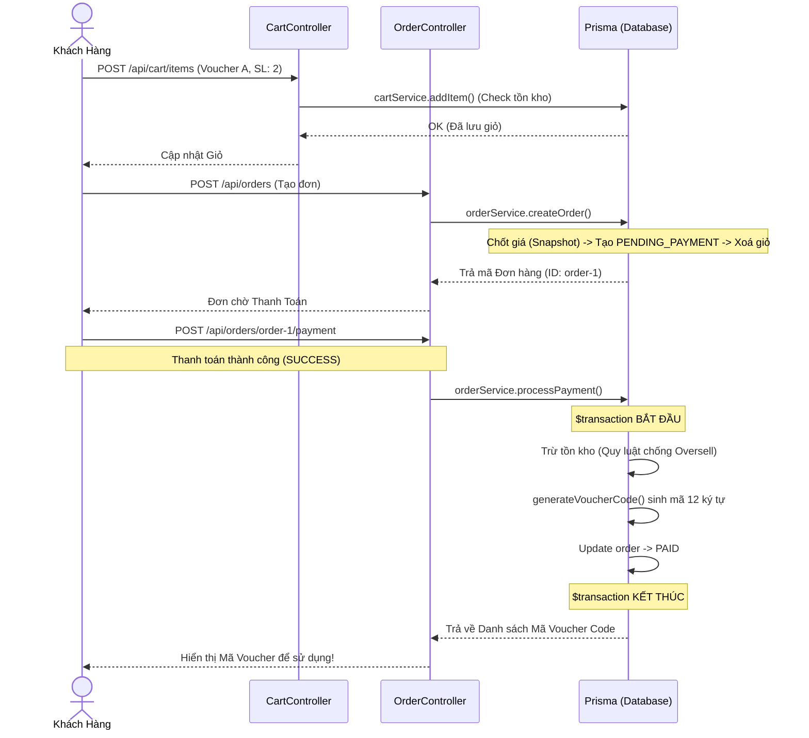

# Bản đồ Module: Cart & Order (Lõi Giao Dịch)

Tài liệu này đóng vai trò như "tấm bản đồ" để bạn dễ dàng tra cứu xem module **Cart (Giỏ hàng)** và **Order (Đơn hàng)** hoạt động ra sao, có những hàm nào và logic bên trong xử lý cái gì.

## 1. Module Cart ([src/modules/cart/cart.service.ts](file:///d:/Project%20c%C3%A1%20nh%C3%A2n/EC-VoucherHub/backend/src/modules/cart/cart.service.ts))

Nơi xử lý việc khách hàng chọn voucher bỏ vào giỏ trước khi thanh toán.

| Tên Hàm                                                                                                               | Payload Đầu Vào                       | Chức năng (Logic cốt lõi)                                                                                                                                                                                      | Các ngoại lệ (Lỗi có thể xảy ra)                                                                                                                                                                                                                                                                             |
| :-------------------------------------------------------------------------------------------------------------------- | :------------------------------------ | :------------------------------------------------------------------------------------------------------------------------------------------------------------------------------------------------------------- | :----------------------------------------------------------------------------------------------------------------------------------------------------------------------------------------------------------------------------------------------------------------------------------------------------------- |
| [getCart](file:///d:/Project%20c%C3%A1%20nh%C3%A2n/EC-VoucherHub/backend/src/modules/cart/cart.service.ts#73-91)      | `customerId`                          | Lấy dữ liệu giỏ hàng của user cùng với các items bên trong. Nếu user chưa có giỏ thì**tự động tạo giỏ mới**.                                                                                                   | Không có                                                                                                                                                                                                                                                                                                     |
| [addItem](file:///d:/Project%20c%C3%A1%20nh%C3%A2n/EC-VoucherHub/backend/src/modules/cart/cart.service.ts#92-169)     | `customerId`, `voucherId`, `quantity` | **Luồng:** 1. Check xem Voucher có đang mở bán không.2. Check tồn kho xem có đủ múc không.3. Nếu trong giỏ đã có sẵn mã này -> Cộng dồn số lượng. Nếu chưa có -> Tạo mới.4. Lấy giá Sale hiện tại để làm base. | -[NotFoundError](file:///d:/Project%20c%C3%A1%20nh%C3%A2n/EC-VoucherHub/backend/src/middleware/error-handler.ts#21-27): Không tìm thấy voucher- [ValidationError](file:///d:/Project%20c%C3%A1%20nh%C3%A2n/EC-VoucherHub/backend/src/middleware/error-handler.ts#28-37): Tồn kho không đủ, voucher ngưng bán |
| [updateItem](file:///d:/Project%20c%C3%A1%20nh%C3%A2n/EC-VoucherHub/backend/src/modules/cart/cart.service.ts#170-215) | `customerId`, `itemId`, `quantity`    | Tương tự[addItem](file:///d:/Project%20c%C3%A1%20nh%C3%A2n/EC-VoucherHub/backend/src/modules/cart/cart.service.ts#92-169) nhưng gán đè cứng số `quantity` thay vì cộng dồn. Cũng phải xác minh lại tồn kho.    | -[NotFoundError](file:///d:/Project%20c%C3%A1%20nh%C3%A2n/EC-VoucherHub/backend/src/middleware/error-handler.ts#21-27): Không có item trong giỏ- [ValidationError](file:///d:/Project%20c%C3%A1%20nh%C3%A2n/EC-VoucherHub/backend/src/middleware/error-handler.ts#28-37): Quá tồn kho                        |
| [removeItem](file:///d:/Project%20c%C3%A1%20nh%C3%A2n/EC-VoucherHub/backend/src/modules/cart/cart.service.ts#216-240) | `customerId`, `itemId`                | Xoá hẳn item khỏi giỏ hàng. Nếu giỏ rỗng thì vẫn giữ vỏ, chỉ dọn items.                                                                                                                                        | -[NotFoundError](file:///d:/Project%20c%C3%A1%20nh%C3%A2n/EC-VoucherHub/backend/src/middleware/error-handler.ts#21-27): Không có item                                                                                                                                                                        |

---

## 2. Module Order ([src/modules/order/order.service.ts](file:///d:/Project%20c%C3%A1%20nh%C3%A2n/EC-VoucherHub/backend/src/modules/order/order.service.ts))

Là hệ thống **Lõi (Core)** thực sự xử lý giao dịch tiền và quản lý tồn kho ngặt nghèo nhất.

| Tên Hàm                                                                                                                     | Payload Đầu Vào                                                                                                                            | Chức năng (Logic cốt lõi)                                                                                                                                                                                                                                                                                                 | Các ngoại lệ (Lỗi có thể xảy ra)                                                                                                                                                                                                                                                                                               |
| :-------------------------------------------------------------------------------------------------------------------------- | :----------------------------------------------------------------------------------------------------------------------------------------- | :------------------------------------------------------------------------------------------------------------------------------------------------------------------------------------------------------------------------------------------------------------------------------------------------------------------------ | :----------------------------------------------------------------------------------------------------------------------------------------------------------------------------------------------------------------------------------------------------------------------------------------------------------------------------- |
| [createOrder](file:///d:/Project%20c%C3%A1%20nh%C3%A2n/EC-VoucherHub/backend/src/modules/order/order.service.ts#90-204)     | `customerId`, `CreateOrderDto`                                                                                                             | **Luồng (Transaction):**1. Bốc toàn bộ items từ Giỏ hàng của user ra.2. Kiểm tra lại lần chót tồn kho và trạng thái Voucher.3. Snapshot giá tiền (vì lỡ mai voucher đổi giá thì đơn hàng hôm nay không bị ảnh hưởng).4. Tạo Order mới dạng `PENDING_PAYMENT`.5. Xoá các items đã mua khỏi Giỏ hàng.                       | -[ValidationError](file:///d:/Project%20c%C3%A1%20nh%C3%A2n/EC-VoucherHub/backend/src/middleware/error-handler.ts#28-37): Giỏ hàng rỗng, hoặc 1 voucher bất kỳ bỗng dưng hết hàng.                                                                                                                                             |
| [getMyOrders](file:///d:/Project%20c%C3%A1%20nh%C3%A2n/EC-VoucherHub/backend/src/modules/order/order.service.ts#205-239)    | `customerId`, `cursor`, `limit`                                                                                                            | Lấy danh sách các đơn đã đặt (có hỗ trợ phân trang Cursor).                                                                                                                                                                                                                                                               | Không có                                                                                                                                                                                                                                                                                                                       |
| [processPayment](file:///d:/Project%20c%C3%A1%20nh%C3%A2n/EC-VoucherHub/backend/src/modules/order/order.service.ts#263-439) | `customerId`, `orderId`, [PaymentDto](file:///d:/Project%20c%C3%A1%20nh%C3%A2n/EC-VoucherHub/backend/src/modules/order/order.dto.ts#10-11) | **Luồng lõi (Giao dịch Nguyên tử):**1. Kiểm tra đơn hàng có đúng là hệ `PENDING_PAYMENT` không.2. Nếu mô phỏng `FAILURE` -> Không làm gì cả.3. Nếu `SUCCESS` -> Khóa bảng Voucher và bắt đầu trừ kho.4. Sinh mã Random duy nhất từ `crypto` dài 12 ký tự cho từng sản phẩm.5. Lưu Codes vào DB và cập nhật đơn -> `PAID`. | -[ConflictError](file:///d:/Project%20c%C3%A1%20nh%C3%A2n/EC-VoucherHub/backend/src/middleware/error-handler.ts#48-54): Đã thanh toán rồi- [ValidationError](file:///d:/Project%20c%C3%A1%20nh%C3%A2n/EC-VoucherHub/backend/src/middleware/error-handler.ts#28-37): Kẻ nào đó đã nhanh tay nẫng mất hàng cuối cùng (Oversell). |

---

## 3. Sơ đồ Luồng (Flow Diagram) cho Giao Dịch

Dưới đây là mô phỏng luồng gọi hàm từ lúc Add Voucher cho tới lúc Tiền trao cháo múc:

