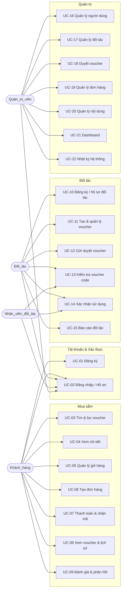

# Use Cases — Đặc tả Use Case

> Hệ thống Thương mại điện tử bán Voucher giảm giá trực tuyến (Hệ_thống)
> Nguồn: `docs/02-srs/README.md`. Mỗi use case map về FR/FLOW trong SRS.

## 1. Sơ đồ Use Case

> Mermaid không có ký hiệu UML use-case gốc — mô hình hóa bằng graph: actor → use case.

## 2. Bảng ánh xạ Use Case → FR / FLOW

| UC | Tên | Actor chính | FR | FLOW |
| --- | --- | --- | --- | --- |
| UC-01 | Đăng ký tài khoản | Khách_hàng | FR-01 | FLOW-001 |
| UC-02 | Đăng nhập & quản lý hồ sơ | Mọi vai trò | FR-02, FR-03 | FLOW-001 |
| UC-03 | Tìm kiếm & lọc voucher | Khách_hàng | FR-04 | FLOW-002 |
| UC-04 | Xem chi tiết voucher | Khách_hàng | FR-05 | FLOW-002 |
| UC-05 | Quản lý giỏ hàng | Khách_hàng | FR-06 | FLOW-003 |
| UC-06 | Tạo đơn hàng | Khách_hàng | FR-07 | FLOW-003 |
| UC-07 | Thanh toán & nhận mã | Khách_hàng | FR-08 | FLOW-003 |
| UC-08 | Xem voucher đã mua & lịch sử | Khách_hàng | FR-09 | FLOW-003 |
| UC-09 | Đánh giá & phản hồi | Khách_hàng | FR-10 | FLOW-004 |
| UC-10 | Đăng ký & quản lý hồ sơ đối tác | Đối_tác | FR-11 | FLOW-005 |
| UC-11 | Tạo & quản lý voucher | Đối_tác | FR-12 | FLOW-006 |
| UC-12 | Gửi duyệt voucher | Đối_tác | FR-13 | FLOW-006 |
| UC-13 | Kiểm tra voucher code | Đối_tác, Nhân_viên_đối_tác | FR-14 | FLOW-007 |
| UC-14 | Xác nhận sử dụng voucher | Đối_tác, Nhân_viên_đối_tác | FR-15 | FLOW-007 |
| UC-15 | Báo cáo đối tác | Đối_tác | FR-16 | FLOW-008 |
| UC-16 | Quản lý người dùng | Quản_trị_viên | FR-17 | FLOW-009 |
| UC-17 | Quản lý đối tác | Quản_trị_viên | FR-18 | FLOW-005 |
| UC-18 | Duyệt voucher | Quản_trị_viên | FR-19 | FLOW-006 |
| UC-19 | Quản lý đơn hàng | Quản_trị_viên | FR-20 | FLOW-010 |
| UC-20 | Quản lý nội dung | Quản_trị_viên | FR-21 | FLOW-011 |
| UC-21 | Dashboard quản trị | Quản_trị_viên | FR-22 | FLOW-011 |
| UC-22 | Nhật ký hệ thống | Quản_trị_viên | FR-23 | FLOW-012 |

## 3. Đặc tả Use Case chi tiết

> Định dạng: actor, FR/FLOW liên quan, tiền điều kiện, kích hoạt, luồng chính, luồng thay thế, luồng ngoại lệ, hậu điều kiện.

### UC-01 — Đăng ký tài khoản

- **Actor**: Khách_hàng
- **FR/FLOW**: FR-01 / FLOW-001
- **Tiền điều kiện**: chưa đăng nhập.
- **Kích hoạt**: gửi form đăng ký.
- **Luồng chính**:
  1. Nhập email hoặc số điện thoại + mật khẩu + hồ sơ.
  2. Hệ_thống kiểm tra định danh chưa tồn tại.
  3. Hệ_thống kiểm tra mật khẩu ≥ 8 ký tự.
  4. Hệ_thống băm mật khẩu, tạo tài khoản vai trò Khách_hàng.
  5. Hệ_thống gửi mã xác thực mô phỏng (in-app).
- **Luồng thay thế**: —
- **Luồng ngoại lệ**:
  - 2a. Định danh đã tồn tại → từ chối, thông báo trùng lặp.
  - 3a. Mật khẩu < 8 ký tự → từ chối, thông báo định dạng.
- **Hậu điều kiện**: tài khoản Khách_hàng tồn tại, mật khẩu lưu dạng băm.

### UC-02 — Đăng nhập & quản lý hồ sơ

- **Actor**: mọi vai trò
- **FR/FLOW**: FR-02, FR-03 / FLOW-001
- **Tiền điều kiện**: có tài khoản.
- **Kích hoạt**: gửi form đăng nhập / yêu cầu đổi-quên mật khẩu / cập nhật hồ sơ.
- **Luồng chính**:
  1. Nhập thông tin đăng nhập.
  2. Hệ_thống xác thực, tạo phiên gắn vai trò.
  3. Người dùng cập nhật hồ sơ / đổi mật khẩu / đăng xuất khi cần.
- **Luồng thay thế**:
  - Quên mật khẩu → Hệ_thống gửi mã đặt lại mô phỏng.
  - Đổi mật khẩu (mật khẩu hiện tại đúng) → cập nhật băm.
- **Luồng ngoại lệ**:
  - 2a. Sai thông tin → từ chối, thông báo sai thông tin.
  - 2b. Tài khoản `bi_khoa` → từ chối, thông báo bị khóa.
  - 2c. Gọi chức năng cần xác thực khi chưa đăng nhập → chuyển hướng đăng nhập.
- **Hậu điều kiện**: phiên hợp lệ theo vai trò, hoặc hồ sơ/mật khẩu được cập nhật.

### UC-03 — Tìm kiếm & lọc voucher

- **Actor**: Khách_hàng
- **FR/FLOW**: FR-04 / FLOW-002
- **Tiền điều kiện**: —
- **Kích hoạt**: nhập từ khóa hoặc chọn bộ lọc.
- **Luồng chính**:
  1. Nhập từ khóa và/hoặc bộ lọc (danh mục, khu vực, giá, mức giảm, đối tác, hiệu lực).
  2. Hệ_thống truy vấn voucher `dang_ban` thỏa **tất cả** tiêu chí (AND).
  3. Hệ_thống trả danh sách kết quả.
- **Luồng ngoại lệ**:
  - 2a. Không có kết quả → danh sách rỗng + thông báo.
- **Hậu điều kiện**: hiển thị danh sách voucher đang bán phù hợp.

### UC-04 — Xem chi tiết voucher

- **Actor**: Khách_hàng
- **FR/FLOW**: FR-05 / FLOW-002
- **Tiền điều kiện**: voucher `dang_ban`.
- **Kích hoạt**: mở chi tiết một voucher.
- **Luồng chính**:
  1. Hệ_thống hiển thị tên, ảnh, giá gốc/bán, điều kiện, thời gian sử dụng, số lượng còn lại, chi nhánh, chính sách hoàn hủy.
- **Luồng ngoại lệ**:
  - 1a. Số lượng còn lại = 0 → hiển thị hết hàng + vô hiệu hóa "thêm vào giỏ".
- **Hậu điều kiện**: —

### UC-05 — Quản lý giỏ hàng

- **Actor**: Khách_hàng
- **FR/FLOW**: FR-06 / FLOW-003
- **Tiền điều kiện**: đã đăng nhập.
- **Kích hoạt**: thêm/sửa/xóa mục giỏ.
- **Luồng chính**:
  1. Thêm voucher `dang_ban` vào giỏ kèm số lượng.
  2. Cập nhật số lượng (nguyên dương) / xóa mục.
  3. Hệ_thống hiển thị tổng tạm tính = Σ(giá bán × số lượng).
- **Luồng ngoại lệ**:
  - 2a. Số lượng > tồn kho → từ chối, thông báo vượt tồn kho.
- **Hậu điều kiện**: giỏ hàng phản ánh đúng các mục + tổng tạm tính.

### UC-06 — Tạo đơn hàng

- **Actor**: Khách_hàng
- **FR/FLOW**: FR-07 / FLOW-003
- **Tiền điều kiện**: giỏ có ≥ 1 mục.
- **Kích hoạt**: bấm đặt đơn.
- **Luồng chính**:
  1. Hệ_thống kiểm tra tồn kho từng mục.
  2. Tạo đơn `cho_thanh_toan`, tổng = tổng tạm tính.
  3. Ghi nhận phương thức thanh toán mô phỏng.
- **Luồng thay thế**:
  - Mua làm quà → lưu thông tin người nhận cùng đơn.
- **Luồng ngoại lệ**:
  - 1a. Giỏ rỗng → từ chối, thông báo giỏ rỗng.
  - 1b. Mục vượt tồn kho → từ chối, thông báo vượt tồn kho.
- **Hậu điều kiện**: đơn hàng ở trạng thái `cho_thanh_toan`.

### UC-07 — Thanh toán & nhận mã

- **Actor**: Khách_hàng
- **FR/FLOW**: FR-08 / FLOW-003
- **Tiền điều kiện**: đơn `cho_thanh_toan`.
- **Kích hoạt**: xác nhận thanh toán mô phỏng.
- **Luồng chính** (trong một transaction):
  1. Khóa + re-check tồn kho.
  2. Trừ tồn kho theo số lượng mua.
  3. Chuyển đơn → `da_thanh_toan`.
  4. Phát hành 1 mã duy nhất (CSPRNG ≥ 12 ký tự) cho mỗi đơn vị, khởi tạo `chua_su_dung` + `issued_at` + `expires_at`.
  5. Hiển thị mã cho Khách_hàng.
- **Luồng ngoại lệ**:
  - Thanh toán thất bại → giữ `cho_thanh_toan`, không phát hành mã.
  - Lỗi giữa chừng → rollback toàn bộ (không trừ kho, không đổi trạng thái, không tạo mã).
- **Hậu điều kiện**: đơn `da_thanh_toan` + N mã `chua_su_dung`; hoặc không thay đổi gì.

### UC-08 — Xem voucher đã mua & lịch sử

- **Actor**: Khách_hàng
- **FR/FLOW**: FR-09 / FLOW-003
- **Tiền điều kiện**: đã đăng nhập.
- **Kích hoạt**: mở danh sách đơn / chi tiết đơn.
- **Luồng chính**:
  1. Hệ_thống hiển thị danh sách đơn của chính khách kèm trạng thái.
  2. Mở đơn `da_thanh_toan` → hiển thị mã, QR mô phỏng, trạng thái mã.
- **Luồng ngoại lệ**:
  - Truy cập đơn không thuộc mình → từ chối (phạm vi sở hữu).
- **Hậu điều kiện**: —

### UC-09 — Đánh giá & phản hồi

- **Actor**: Khách_hàng
- **FR/FLOW**: FR-10 / FLOW-004
- **Tiền điều kiện**: đã mua hoặc đã dùng voucher.
- **Kích hoạt**: gửi đánh giá / phản hồi.
- **Luồng chính**:
  1. Hệ_thống kiểm tra điều kiện đã mua/đã dùng.
  2. Khách gửi sao [1–5] + nhận xét.
  3. Hệ_thống lưu đánh giá kèm liên kết voucher/đơn.
- **Luồng ngoại lệ**:
  - 1a. Chưa mua/chưa dùng → từ chối, thông báo chưa đủ điều kiện.
  - 2a. Điểm ngoài [1,5] → từ chối.
- **Hậu điều kiện**: đánh giá/phản hồi được lưu.

### UC-10 — Đăng ký & quản lý hồ sơ đối tác

- **Actor**: Đối_tác
- **FR/FLOW**: FR-11 / FLOW-005
- **Tiền điều kiện**: —
- **Kích hoạt**: gửi đăng ký đối tác / cập nhật hồ sơ / quản lý chi nhánh.
- **Luồng chính**:
  1. Gửi thông tin pháp lý + người đại diện.
  2. Hệ_thống tạo hồ sơ `cho_duyet`.
  3. Đối tác thêm/sửa/xóa chi nhánh, cập nhật thông tin khi cần.
- **Luồng ngoại lệ**:
  - 1a. Thiếu thông tin pháp lý bắt buộc → từ chối, thông báo thiếu.
- **Hậu điều kiện**: hồ sơ đối tác `cho_duyet`; chưa được công bố bán voucher.

### UC-11 — Tạo & quản lý voucher

- **Actor**: Đối_tác
- **FR/FLOW**: FR-12 / FLOW-006
- **Tiền điều kiện**: hồ sơ đối tác `da_duyet`.
- **Kích hoạt**: tạo/cập nhật voucher.
- **Luồng chính**:
  1. Nhập giá gốc, giá bán, mô tả, thời gian bán/sử dụng, chi nhánh, số lượng.
  2. Hệ_thống validate (giá bán < giá gốc; đủ thời gian) → tạo voucher `nhap`.
  3. Hệ_thống hiển thị số đã bán/đã dùng/hết hạn mỗi voucher.
- **Luồng ngoại lệ**:
  - 2a. Giá bán ≥ giá gốc → từ chối.
  - 2b. Thiếu thời gian bán/sử dụng → từ chối.
  - Cập nhật voucher ngoài trạng thái `nhap`/`tu_choi` → từ chối.
  - Thao tác voucher không thuộc mình → từ chối (phạm vi sở hữu).
- **Hậu điều kiện**: voucher `nhap` thuộc đối tác.

### UC-12 — Gửi duyệt voucher

- **Actor**: Đối_tác
- **FR/FLOW**: FR-13 / FLOW-006
- **Tiền điều kiện**: voucher `nhap` hoặc `tu_choi`.
- **Kích hoạt**: bấm gửi duyệt.
- **Luồng chính**:
  1. Hệ_thống re-validate giá + thời gian.
  2. Chuyển voucher → `cho_duyet`.
- **Luồng ngoại lệ**:
  - 1a. Giá bán ≥ giá gốc hoặc thiếu thời gian → từ chối chuyển, báo lỗi.
- **Hậu điều kiện**: voucher `cho_duyet`, chờ admin.

### UC-13 — Kiểm tra voucher code

- **Actor**: Đối_tác, Nhân_viên_đối_tác
- **FR/FLOW**: FR-14 / FLOW-007
- **Tiền điều kiện**: đã đăng nhập vai trò đối tác/nhân viên.
- **Kích hoạt**: nhập mã hoặc quét QR mô phỏng.
- **Luồng chính**:
  1. Hệ_thống tra mã → hiển thị trạng thái + thông tin voucher.
  2. Mã hợp lệ để dùng ⇔ `chua_su_dung` và chưa quá `expires_at`.
- **Luồng ngoại lệ**:
  - 1a. Mã không tồn tại → "mã không hợp lệ".
  - 1b. Mã thuộc đối tác khác → từ chối, "ngoài phạm vi".
- **Hậu điều kiện**: —

### UC-14 — Xác nhận sử dụng voucher

- **Actor**: Đối_tác, Nhân_viên_đối_tác
- **FR/FLOW**: FR-15 / FLOW-007
- **Tiền điều kiện**: mã hợp lệ trong phạm vi đối tác/chi nhánh.
- **Kích hoạt**: bấm xác nhận sử dụng.
- **Luồng chính** (transaction):
  1. Hệ_thống kiểm tra trạng thái + hạn + phạm vi.
  2. Mã một-lượt → chuyển `da_su_dung` + ghi Nhật_ký_sử_dụng.
- **Luồng thay thế**:
  - Mã multi-use còn lượt > 0 → ghi log + giảm lượt 1; chỉ chuyển `da_su_dung` khi lượt = 0.
- **Luồng ngoại lệ**:
  - 1a. Mã đã dùng (một-lượt) → từ chối, "mã đã sử dụng".
  - 1b. Mã `het_han`/`bi_huy`/`bi_khoa` → từ chối, "không sử dụng được".
  - 1c. Ngoài phạm vi → từ chối, "ngoài phạm vi".
- **Hậu điều kiện**: trạng thái mã/lượt cập nhật + có bản ghi sử dụng; hoặc không đổi.

### UC-15 — Báo cáo đối tác

- **Actor**: Đối_tác
- **FR/FLOW**: FR-16 / FLOW-008
- **Tiền điều kiện**: đã đăng nhập đối tác.
- **Kích hoạt**: mở báo cáo.
- **Luồng chính**:
  1. Hệ_thống tổng hợp doanh thu, số phát hành, số đã bán, tỷ lệ sử dụng theo từng voucher trong phạm vi đối tác.
- **Hậu điều kiện**: —

### UC-16 — Quản lý người dùng

- **Actor**: Quản_trị_viên
- **FR/FLOW**: FR-17 / FLOW-009
- **Tiền điều kiện**: vai trò Quản_trị_viên.
- **Kích hoạt**: tra cứu/khóa/mở khóa/đổi vai trò.
- **Luồng chính**:
  1. Tra cứu người dùng theo tiêu chí → danh sách + vai trò + trạng thái.
  2. Khóa → `bi_khoa` / mở khóa → `hoat_dong` / đổi vai trò → cập nhật.
  3. Hệ_thống ghi Nhật_ký_hệ_thống.
- **Hậu điều kiện**: trạng thái/vai trò tài khoản cập nhật + audit.

### UC-17 — Quản lý đối tác

- **Actor**: Quản_trị_viên
- **FR/FLOW**: FR-18 / FLOW-005
- **Tiền điều kiện**: vai trò Quản_trị_viên.
- **Kích hoạt**: duyệt/từ chối/khóa/mở khóa đối tác; cập nhật chi nhánh.
- **Luồng chính**:
  1. Duyệt hồ sơ `cho_duyet` → `da_duyet`.
  2. Hoặc từ chối → `tu_choi` + lý do.
  3. Khóa đối tác → `bi_khoa` + dừng công bố voucher; mở khóa → `hoat_dong`.
- **Hậu điều kiện**: trạng thái đối tác cập nhật + audit.

### UC-18 — Duyệt voucher

- **Actor**: Quản_trị_viên
- **FR/FLOW**: FR-19 / FLOW-006
- **Tiền điều kiện**: vai trò Quản_trị_viên.
- **Kích hoạt**: duyệt/từ chối/công bố/tạm ngưng voucher.
- **Luồng chính**:
  1. Duyệt voucher `cho_duyet` → `da_duyet`.
  2. Công bố `da_duyet` → `dang_ban`.
- **Luồng thay thế**:
  - Từ chối → `tu_choi` + lý do.
  - Tạm ngưng `dang_ban` → `tam_ngung` + ẩn khỏi danh sách bán.
- **Luồng ngoại lệ**:
  - Công bố khi không phải `da_duyet` → từ chối.
- **Hậu điều kiện**: trạng thái voucher cập nhật + audit.

### UC-19 — Quản lý đơn hàng

- **Actor**: Quản_trị_viên
- **FR/FLOW**: FR-20 / FLOW-010
- **Tiền điều kiện**: vai trò Quản_trị_viên.
- **Kích hoạt**: tra cứu/hủy/hoàn tiền đơn.
- **Luồng chính**:
  1. Tra cứu đơn → danh sách + trạng thái đơn/thanh toán.
  2. Hủy đơn `cho_thanh_toan` → `da_huy`, không phát hành mã.
  3. Hoàn tiền đơn `da_thanh_toan` → `da_hoan_tien` + mã liên quan → `bi_huy`.
  4. Đơn `da_huy`/`da_hoan_tien` → hoàn trả tồn kho.
  5. Hệ_thống ghi Nhật_ký_hệ_thống.
- **Hậu điều kiện**: trạng thái đơn + mã + tồn kho cập nhật + audit.

### UC-20 — Quản lý nội dung

- **Actor**: Quản_trị_viên
- **FR/FLOW**: FR-21 / FLOW-011
- **Tiền điều kiện**: vai trò Quản_trị_viên.
- **Kích hoạt**: CRUD nội dung.
- **Luồng chính**:
  1. Tạo/cập nhật/xóa danh mục, banner, bài viết, popup, chính sách hợp lệ → lưu.
- **Hậu điều kiện**: nội dung được cập nhật.

### UC-21 — Dashboard quản trị

- **Actor**: Quản_trị_viên
- **FR/FLOW**: FR-22 / FLOW-011
- **Tiền điều kiện**: vai trò Quản_trị_viên.
- **Kích hoạt**: mở dashboard.
- **Luồng chính**:
  1. Hệ_thống tổng hợp toàn hệ thống: tổng người dùng, đối tác, voucher, đơn, doanh thu, voucher đã dùng.
- **Hậu điều kiện**: —

### UC-22 — Nhật ký hệ thống

- **Actor**: Quản_trị_viên
- **FR/FLOW**: FR-23 / FLOW-012
- **Tiền điều kiện**: vai trò Quản_trị_viên.
- **Kích hoạt**: thao tác quản trị quan trọng (tự động ghi) / tra cứu nhật ký.
- **Luồng chính**:
  1. Mỗi thao tác quản trị quan trọng → ghi bản ghi (người, hành động, thời điểm).
  2. Admin tra cứu nhật ký theo tiêu chí → danh sách bản ghi.
- **Hậu điều kiện**: nhật ký phản ánh đầy đủ thao tác quan trọng.
