# Activity Diagrams

> Mỗi FLOW-XXX (định nghĩa trong `docs/02-srs/`) có một sơ đồ hoạt động (Mermaid `flowchart TD`) thể hiện nhánh quyết định và đường lỗi — không chỉ happy path.

## FLOW-001 — Đăng ký & đăng nhập Khách hàng

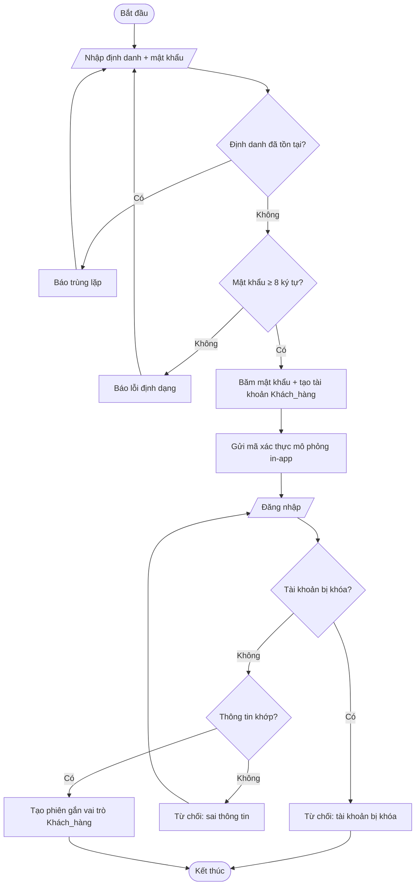

## FLOW-002 — Tìm kiếm → xem chi tiết voucher

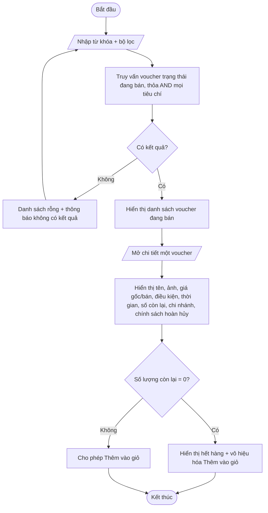

## FLOW-003 — Giỏ hàng → đặt đơn → thanh toán → nhận mã (lõi)

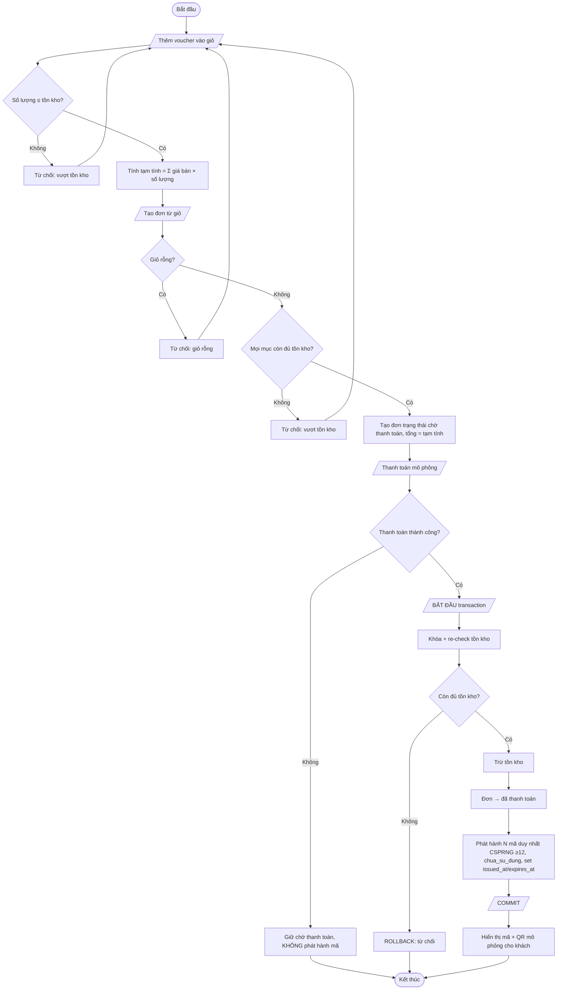

## FLOW-004 — Đánh giá voucher đã mua/dùng

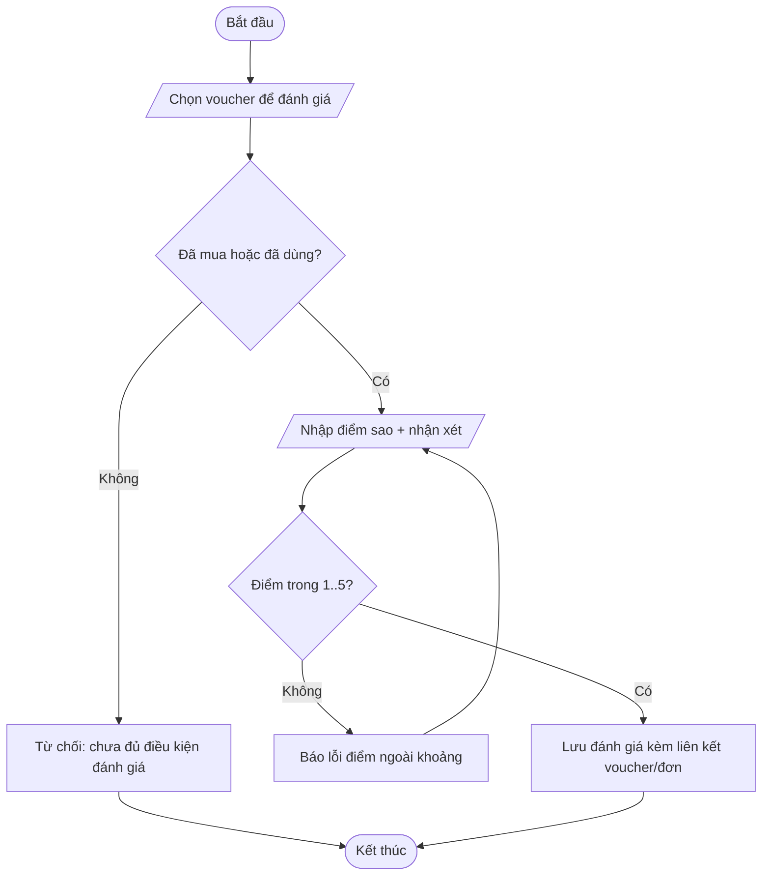

## FLOW-005 — Đăng ký Đối tác → Admin duyệt

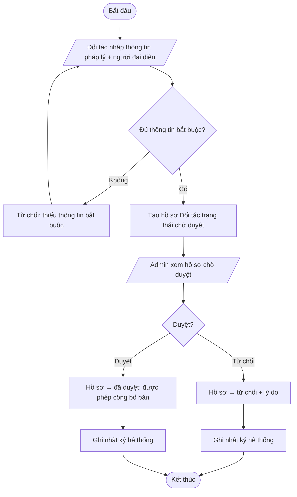

## FLOW-006 — Tạo voucher → gửi duyệt → duyệt → công bố

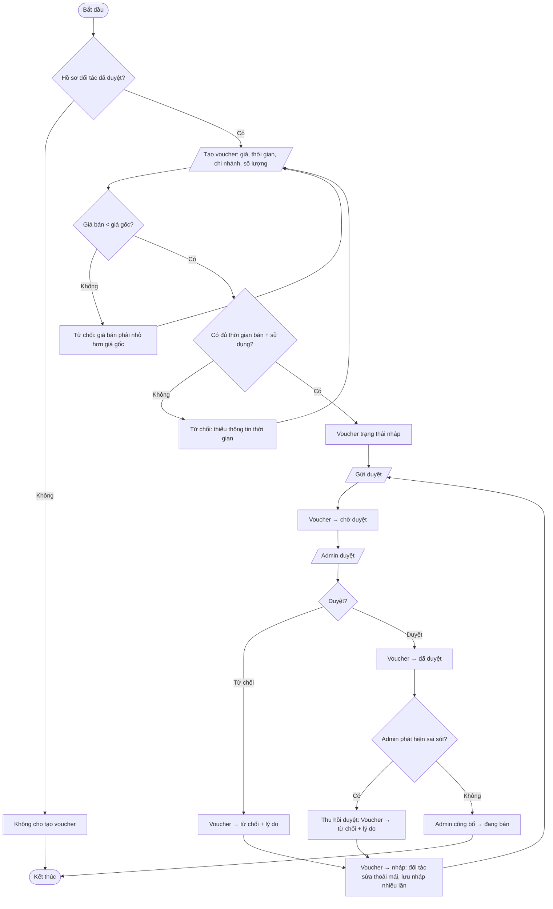

## FLOW-007 — Kiểm tra → xác nhận sử dụng voucher

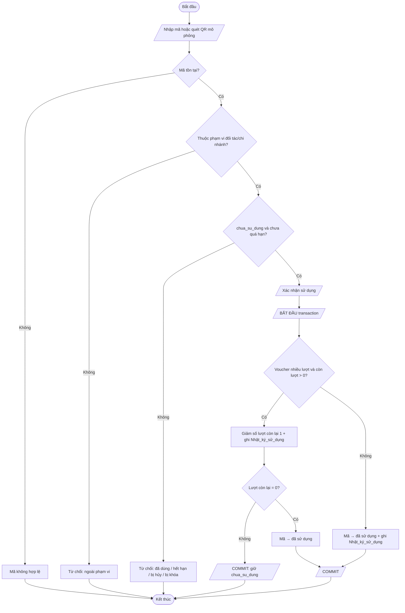

## FLOW-008 — Xem báo cáo Đối tác

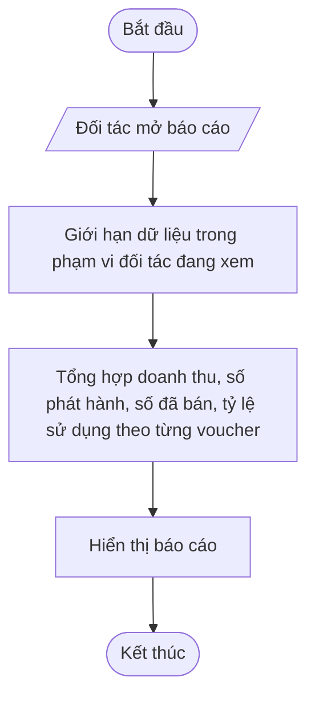

## FLOW-009 — Quản lý & phân quyền người dùng

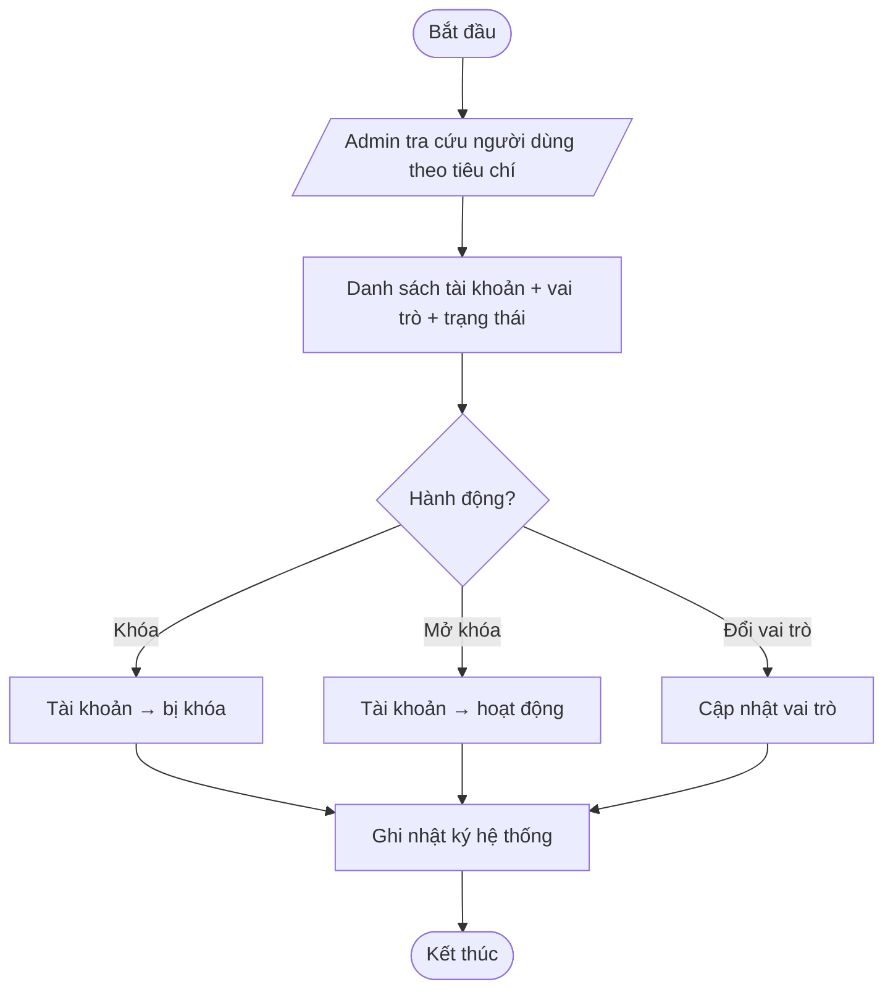

## FLOW-010 — Hủy / hoàn tiền đơn hàng

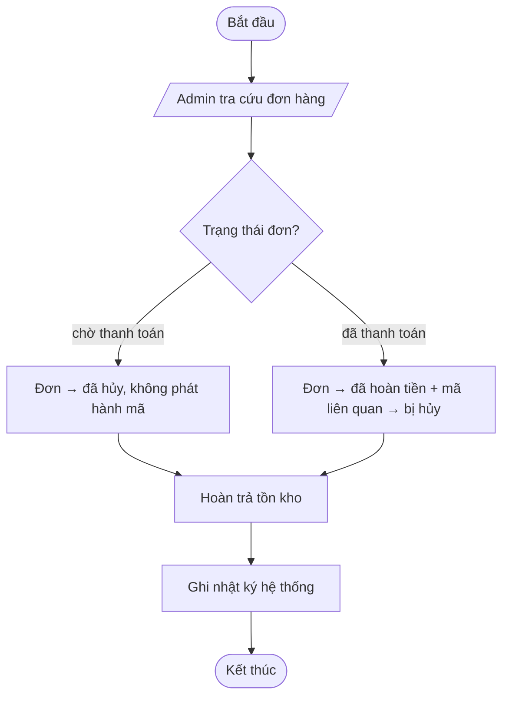

## FLOW-011 — Quản lý nội dung & xem dashboard

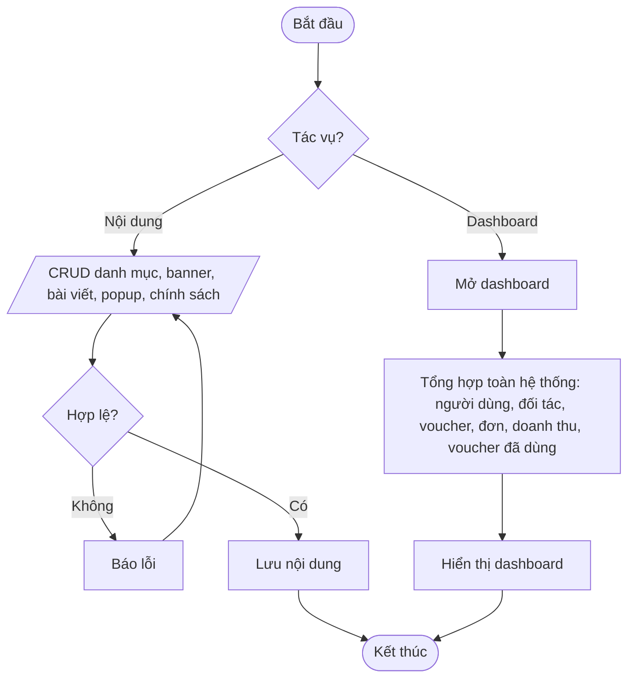

## FLOW-012 — Ghi & tra cứu nhật ký hệ thống

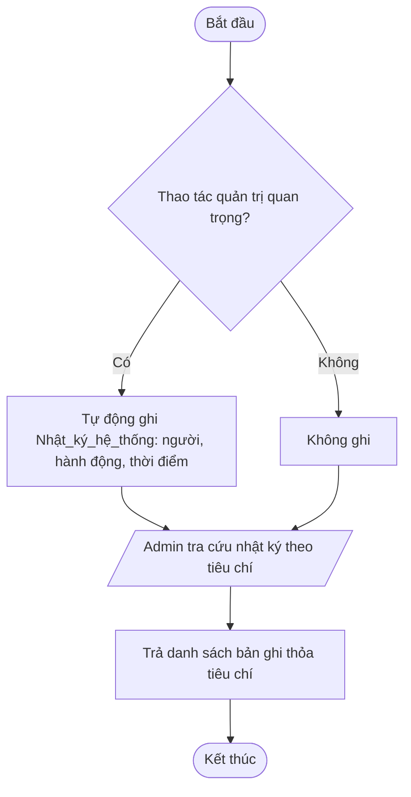
