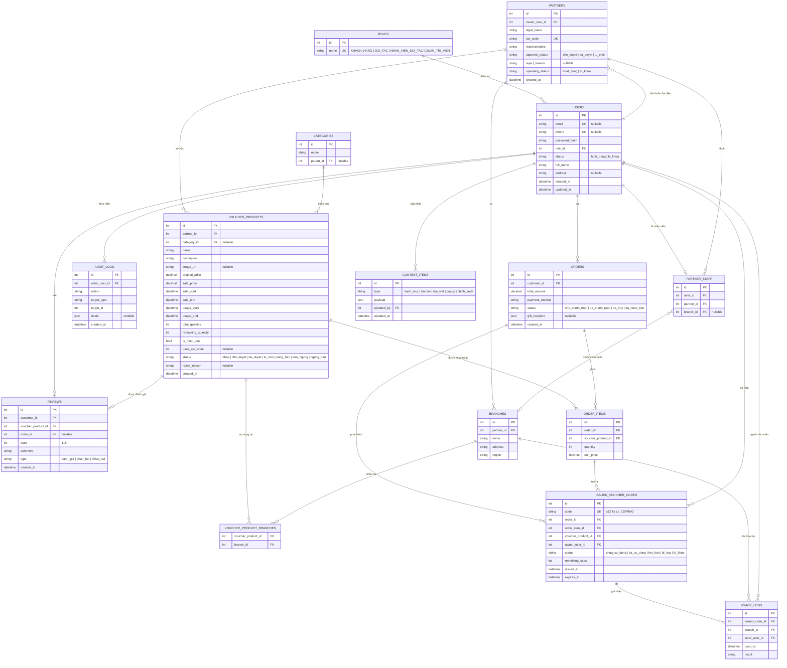

# Database Design — Thiết kế cơ sở dữ liệu

> Hệ thống Thương mại điện tử bán Voucher (Hệ_thống). CSDL quan hệ (PostgreSQL).
> Nguồn: `docs/02-srs/` (FR/NFR), BRD §9 (DR-01..06). Quy ước Prisma: model PascalCase → bảng snake_case qua `@@map`.

## 1. Tổng quan

15 bảng chia 6 nhóm: **Tài khoản & vai trò** (roles, users), **Đối tác** (partners, branches, partner_staff), **Danh mục & voucher** (categories, voucher_products, voucher_product_branches), **Mua hàng** (orders, order_items), **Phát hành & sử dụng** (issued_voucher_codes, usage_logs), **Vận hành** (reviews, audit_logs, content_items).

Ba thực thể trạng thái là trung tâm toàn vẹn (NFR-03): `voucher_products.status`, `orders.status`, `issued_voucher_codes.status` — xem máy trạng thái ở `docs/02-srs/` §1.4 và `docs/06-architecture/`.

## 2. ERD

## 3. Data dictionary

### roles `(R24.5, FR-03)`
| Cột | Kiểu | Ràng buộc | Mô tả |
| --- | --- | --- | --- |
| id | serial | PK | |
| name | varchar(32) | UNIQUE, NOT NULL | 4 vai trò cố định |

### users `(FR-01, FR-02, FR-17; DR-01)`
| Cột | Kiểu | Ràng buộc | Mô tả |
| --- | --- | --- | --- |
| id | serial | PK | |
| email | varchar(255) | UNIQUE, nullable | ít nhất một trong email/phone |
| phone | varchar(20) | UNIQUE, nullable | |
| password_hash | varchar(255) | NOT NULL | chỉ lưu băm (FR-01 AC4) |
| role_id | int | FK→roles, NOT NULL | |
| status | varchar(16) | NOT NULL, default `hoat_dong` | `hoat_dong`/`bi_khoa` |
| full_name | varchar(255) | NOT NULL | |
| address | text | nullable | |
| created_at / updated_at | timestamptz | NOT NULL | |

**CHECK**: `email IS NOT NULL OR phone IS NOT NULL`.

### partners `(FR-11, FR-18; DR-02)`
| Cột | Kiểu | Ràng buộc | Mô tả |
| --- | --- | --- | --- |
| id | serial | PK | |
| owner_user_id | int | FK→users, NOT NULL | tài khoản đại diện |
| legal_name | varchar(255) | NOT NULL | |
| tax_code | varchar(32) | UNIQUE, NOT NULL | |
| representative | varchar(255) | NOT NULL | |
| approval_status | varchar(16) | NOT NULL, default `cho_duyet` | `cho_duyet`/`da_duyet`/`tu_choi` |
| reject_reason | text | nullable | FR-18 AC2 |
| operating_status | varchar(16) | NOT NULL, default `hoat_dong` | `hoat_dong`/`bi_khoa` |
| created_at | timestamptz | NOT NULL | |

### branches `(FR-11 AC4)`
| Cột | Kiểu | Ràng buộc | Mô tả |
| --- | --- | --- | --- |
| id | serial | PK | |
| partner_id | int | FK→partners, NOT NULL | |
| name | varchar(255) | NOT NULL | |
| address | text | NOT NULL | |
| region | varchar(128) | NOT NULL, indexed | lọc khu vực (FR-04) |

### partner_staff `(FR-14, FR-15)`
| Cột | Kiểu | Ràng buộc | Mô tả |
| --- | --- | --- | --- |
| id | serial | PK | |
| user_id | int | FK→users, UNIQUE, NOT NULL | một user là nhân viên của tối đa 1 đối tác |
| partner_id | int | FK→partners, NOT NULL | phạm vi xác thực |
| branch_id | int | FK→branches, nullable | giới hạn chi nhánh |

### categories `(FR-04, FR-21)`
| Cột | Kiểu | Ràng buộc | Mô tả |
| --- | --- | --- | --- |
| id | serial | PK | |
| name | varchar(128) | NOT NULL | |
| parent_id | int | FK→categories, nullable | danh mục cây |

### voucher_products `(FR-12, FR-19; DR-03)`
| Cột | Kiểu | Ràng buộc | Mô tả |
| --- | --- | --- | --- |
| id | serial | PK | |
| partner_id | int | FK→partners, NOT NULL, indexed | phạm vi sở hữu (FR-12 AC7) |
| category_id | int | FK→categories, nullable | |
| name | varchar(255) | NOT NULL | |
| description | text | | |
| image_url | varchar(512) | nullable | |
| original_price | numeric(12,2) | NOT NULL | |
| sale_price | numeric(12,2) | NOT NULL | CHECK `sale_price < original_price` (FR-12 AC3) |
| sale_start / sale_end | timestamptz | NOT NULL | RB-03/04 |
| usage_start / usage_end | timestamptz | NOT NULL | nguồn `expires_at` của code |
| total_quantity | int | NOT NULL, CHECK ≥ 0 | RB-11 |
| remaining_quantity | int | NOT NULL, CHECK ≥ 0 | tồn kho (chống oversell) |
| is_multi_use | bool | NOT NULL, default false | |
| uses_per_code | int | nullable, CHECK > 0 | bắt buộc nếu multi-use |
| status | varchar(16) | NOT NULL, default `nhap`, indexed | 7 trạng thái |
| reject_reason | text | nullable | FR-19 AC2 |
| created_at | timestamptz | NOT NULL | |

**CHECK**: `remaining_quantity <= total_quantity`.

### voucher_product_branches `(FR-12 AC1)` — nhiều–nhiều
| Cột | Kiểu | Ràng buộc | Mô tả |
| --- | --- | --- | --- |
| voucher_product_id | int | FK, PK (kép) | |
| branch_id | int | FK, PK (kép) | |

### orders `(FR-07, FR-08, FR-20; DR-04)`
| Cột | Kiểu | Ràng buộc | Mô tả |
| --- | --- | --- | --- |
| id | serial | PK | |
| customer_id | int | FK→users, NOT NULL, indexed | phạm vi sở hữu (FR-09 AC3) |
| total_amount | numeric(12,2) | NOT NULL | = Σ unit_price × quantity |
| payment_method | varchar(32) | NOT NULL | thanh toán mô phỏng |
| status | varchar(16) | NOT NULL, default `cho_thanh_toan` | 4 trạng thái |
| gift_recipient | jsonb | nullable | FR-07 AC2 |
| created_at | timestamptz | NOT NULL | |

### order_items `(FR-07 AC1)`
| Cột | Kiểu | Ràng buộc | Mô tả |
| --- | --- | --- | --- |
| id | serial | PK | |
| order_id | int | FK→orders, NOT NULL | |
| voucher_product_id | int | FK→voucher_products, NOT NULL | |
| quantity | int | NOT NULL, CHECK > 0 | |
| unit_price | numeric(12,2) | NOT NULL | snapshot giá bán lúc đặt |

### issued_voucher_codes `(FR-08, FR-09, FR-15; DR-05)`
| Cột | Kiểu | Ràng buộc | Mô tả |
| --- | --- | --- | --- |
| id | serial | PK | |
| code | varchar(32) | **UNIQUE**, NOT NULL | ≥12 ký tự CSPRNG (FR-08 AC3/4) |
| order_id | int | FK→orders, NOT NULL | |
| order_item_id | int | FK→order_items, NOT NULL | |
| voucher_product_id | int | FK→voucher_products, NOT NULL, indexed | phạm vi đối tác (FR-14 AC3) |
| owner_user_id | int | FK→users, NOT NULL | |
| status | varchar(16) | NOT NULL, default `chua_su_dung`, indexed | 5 trạng thái |
| remaining_uses | int | NOT NULL, default 1 | multi-use (FR-15 AC5) |
| issued_at | timestamptz | NOT NULL | |
| expires_at | timestamptz | NOT NULL | từ `usage_end` (FR-08 AC5) |

### usage_logs `(FR-15 AC1/5)`
| Cột | Kiểu | Ràng buộc | Mô tả |
| --- | --- | --- | --- |
| id | serial | PK | |
| issued_code_id | int | FK→issued_voucher_codes, NOT NULL | |
| branch_id | int | FK→branches, NOT NULL | |
| actor_user_id | int | FK→users, NOT NULL | đối tác/nhân viên xác nhận |
| used_at | timestamptz | NOT NULL | |
| result | varchar(32) | NOT NULL | kết quả xác nhận |

### reviews `(FR-10; DR-06)`
| Cột | Kiểu | Ràng buộc | Mô tả |
| --- | --- | --- | --- |
| id | serial | PK | |
| customer_id | int | FK→users, NOT NULL | |
| voucher_product_id | int | FK→voucher_products, NOT NULL | |
| order_id | int | FK→orders, nullable | |
| stars | smallint | CHECK 1..5 | FR-10 AC3 |
| comment | text | | |
| type | varchar(16) | NOT NULL | `danh_gia`/`phan_hoi`/`khieu_nai` |
| created_at | timestamptz | NOT NULL | |

### audit_logs `(FR-23; DR — Nhật_ký_hệ_thống)`
| Cột | Kiểu | Ràng buộc | Mô tả |
| --- | --- | --- | --- |
| id | serial | PK | |
| actor_user_id | int | FK→users, NOT NULL | |
| action | varchar(64) | NOT NULL | duyệt/khóa/hủy/hoàn tiền… |
| target_type | varchar(32) | NOT NULL | loại đối tượng |
| target_id | int | NOT NULL | |
| detail | jsonb | nullable | |
| created_at | timestamptz | NOT NULL, indexed | tra cứu theo thời gian |

### content_items `(FR-21)`
| Cột | Kiểu | Ràng buộc | Mô tả |
| --- | --- | --- | --- |
| id | serial | PK | |
| type | varchar(16) | NOT NULL | 5 loại nội dung |
| payload | jsonb | NOT NULL | nội dung linh hoạt |
| updated_by | int | FK→users, NOT NULL | |
| updated_at | timestamptz | NOT NULL | |

## 4. Indexes

| Bảng | Index | Lý do |
| --- | --- | --- |
| users | UNIQUE(email), UNIQUE(phone) | định danh duy nhất (FR-01 AC2) |
| partners | UNIQUE(tax_code) | mã số thuế duy nhất |
| partner_staff | UNIQUE(user_id) | một user ↔ tối đa 1 đối tác |
| voucher_products | (status), (partner_id), (category_id) | lọc danh sách bán + phạm vi sở hữu |
| voucher_products | (region qua branches) | lọc khu vực (FR-04) |
| issued_voucher_codes | **UNIQUE(code)** | Property 1 — duy nhất mã |
| issued_voucher_codes | (voucher_product_id), (owner_user_id), (status) | xác thực + phạm vi + tra cứu |
| orders | (customer_id), (status) | lịch sử đơn + tra cứu admin |
| order_items | (order_id), (voucher_product_id) | join |
| usage_logs | (issued_code_id) | lịch sử sử dụng |
| audit_logs | (created_at), (actor_user_id) | tra cứu nhật ký |

## 5. Ràng buộc toàn vẹn then chốt

| Ràng buộc | Cơ chế | Bảo vệ |
| --- | --- | --- |
| Mã voucher duy nhất | UNIQUE(code) + retry khi đụng độ | Property 1 (FR-08 AC3) |
| Không bán vượt tồn kho | `UPDATE … WHERE remaining_quantity >= qty` trong TX | Property 5 (FR-07/08) |
| Giá bán < giá gốc | CHECK constraint | FR-12 AC3 |
| Bảo toàn tồn kho | TX trừ/hoàn khi thanh toán/hủy/hoàn | Property 6 (FR-20 AC4) |
| Phát hành chỉ sau thanh toán | issue trong cùng TX với `da_thanh_toan` | Property 3/4 (FR-08) |

> Chi tiết transaction + máy trạng thái: `docs/06-architecture/`. 
