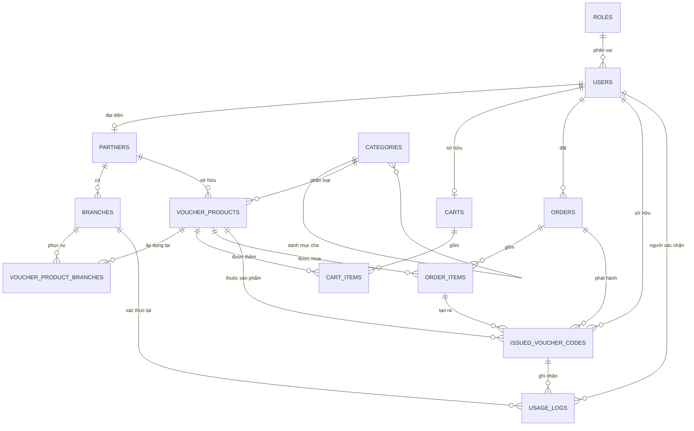

# Database Design — Thiết kế cơ sở dữ liệu

> Trạng thái hiện tại của tầng DB trong codebase `EC-VoucherHub`.

## 1. Tổng quan

Schema hiện tại đã triển khai **13 bảng MVP-High** trong PostgreSQL qua Prisma:

- **Tài khoản & vai trò**: `roles`, `users`
- **Đối tác**: `partners`, `branches`
- **Danh mục & voucher**: `categories`, `voucher_products`, `voucher_product_branches`
- **Giỏ hàng**: `carts`, `cart_items`
- **Mua hàng**: `orders`, `order_items`
- **Phát hành & sử dụng**: `issued_voucher_codes`, `usage_logs`

Các bảng **chưa có trong schema hiện tại** và đang nằm ngoài scope triển khai:

- `partner_staff`
- `reviews`
- `audit_logs`
- `content_items`

Ba thực thể trạng thái trung tâm:

- `voucher_products.status`
- `orders.status`
- `issued_voucher_codes.status`

## 2. Quy ước kiểu dữ liệu

- `Role.id`, `Category.id`, `Branch.id`, `CartItem.id`, `OrderItem.id`, `UsageLog.id` dùng `int / serial`
- Hầu hết entity nghiệp vụ chính dùng `uuid`:
  - `users.id`
  - `partners.id`
  - `voucher_products.id`
  - `carts.id`
  - `orders.id`
  - `issued_voucher_codes.id`
- Tiền tệ dùng `numeric(12,2)`
- Thời gian dùng `timestamptz(6)`
- Enum DB được map qua Prisma enum + `@@map(...)`

## 3. ERD hiện tại

## 4. Data Dictionary

### `roles`

| Cột | Kiểu | Ràng buộc | Ghi chú |
| --- | --- | --- | --- |
| `id` | `serial` | PK | |
| `name` | `varchar(32)` | UNIQUE, NOT NULL | vai trò cố định |

### `users`

| Cột | Kiểu | Ràng buộc | Ghi chú |
| --- | --- | --- | --- |
| `id` | `uuid` | PK | |
| `email` | `varchar(255)` | UNIQUE, nullable | |
| `phone` | `varchar(20)` | UNIQUE, nullable | |
| `password_hash` | `varchar(255)` | NOT NULL | |
| `role_id` | `int` | FK→`roles`, NOT NULL | |
| `status` | `user_status` | NOT NULL, default `active` | |
| `full_name` | `varchar(255)` | NOT NULL | |
| `address` | `text` | nullable | |
| `created_at` | `timestamptz(6)` | NOT NULL | |
| `updated_at` | `timestamptz(6)` | NOT NULL | |

**CHECK**: `email IS NOT NULL OR phone IS NOT NULL`.

### `partners`

| Cột | Kiểu | Ràng buộc | Ghi chú |
| --- | --- | --- | --- |
| `id` | `uuid` | PK | |
| `owner_user_id` | `uuid` | FK→`users`, UNIQUE, NOT NULL | 1 user ↔ tối đa 1 partner |
| `legal_name` | `varchar(255)` | NOT NULL | |
| `tax_code` | `varchar(32)` | UNIQUE, NOT NULL | |
| `representative` | `varchar(255)` | NOT NULL | |
| `approval_status` | `approval_status` | NOT NULL, default `pending` | |
| `reject_reason` | `text` | nullable | |
| `operating_status` | `operating_status` | NOT NULL, default `active` | |
| `created_at` | `timestamptz(6)` | NOT NULL | |
| `updated_at` | `timestamptz(6)` | NOT NULL | |

### `branches`

| Cột | Kiểu | Ràng buộc | Ghi chú |
| --- | --- | --- | --- |
| `id` | `serial` | PK | |
| `partner_id` | `uuid` | FK→`partners`, NOT NULL | |
| `name` | `varchar(255)` | NOT NULL | |
| `address` | `text` | NOT NULL | |
| `region` | `varchar(128)` | NOT NULL | lọc khu vực |

### `categories`

| Cột | Kiểu | Ràng buộc | Ghi chú |
| --- | --- | --- | --- |
| `id` | `serial` | PK | |
| `name` | `varchar(128)` | NOT NULL | |
| `parent_id` | `int` | FK→`categories`, nullable | cây danh mục |

**UNIQUE**: `(name, parent_id)`.

### `voucher_products`

| Cột | Kiểu | Ràng buộc | Ghi chú |
| --- | --- | --- | --- |
| `id` | `uuid` | PK | |
| `partner_id` | `uuid` | FK→`partners`, NOT NULL | |
| `category_id` | `int` | FK→`categories`, nullable | |
| `name` | `varchar(255)` | NOT NULL | |
| `description` | `text` | NOT NULL | |
| `image_url` | `varchar(512)` | nullable | |
| `original_price` | `numeric(12,2)` | NOT NULL | |
| `sale_price` | `numeric(12,2)` | NOT NULL | phải nhỏ hơn giá gốc |
| `sale_start` | `timestamptz(6)` | NOT NULL | |
| `sale_end` | `timestamptz(6)` | NOT NULL | |
| `usage_start` | `timestamptz(6)` | NOT NULL | |
| `usage_end` | `timestamptz(6)` | NOT NULL | |
| `total_quantity` | `int` | NOT NULL | |
| `remaining_quantity` | `int` | NOT NULL | |
| `is_multi_use` | `bool` | NOT NULL, default `false` | |
| `uses_per_code` | `int` | nullable | nếu có giá trị thì phải `> 0`; nếu multi-use thì bắt buộc phải có giá trị dương |
| `status` | `voucher_status` | NOT NULL, default `draft` | |
| `reject_reason` | `text` | nullable | |
| `created_at` | `timestamptz(6)` | NOT NULL | |
| `updated_at` | `timestamptz(6)` | NOT NULL | |

**CHECK**:

- `sale_price < original_price`
- `total_quantity >= 0`
- `remaining_quantity >= 0`
- `remaining_quantity <= total_quantity`
- `(uses_per_code IS NULL OR uses_per_code > 0)`
- `is_multi_use = false OR uses_per_code IS NOT NULL`

### `voucher_product_branches`

| Cột | Kiểu | Ràng buộc | Ghi chú |
| --- | --- | --- | --- |
| `voucher_product_id` | `uuid` | FK, PK kép | |
| `branch_id` | `int` | FK, PK kép | |

### `carts`

| Cột | Kiểu | Ràng buộc | Ghi chú |
| --- | --- | --- | --- |
| `id` | `uuid` | PK | |
| `customer_id` | `uuid` | FK→`users`, UNIQUE, NOT NULL | 1 khách ↔ 1 giỏ |
| `created_at` | `timestamptz(6)` | NOT NULL | |
| `updated_at` | `timestamptz(6)` | NOT NULL | |

### `cart_items`

| Cột | Kiểu | Ràng buộc | Ghi chú |
| --- | --- | --- | --- |
| `id` | `serial` | PK | |
| `cart_id` | `uuid` | FK→`carts`, NOT NULL | |
| `voucher_product_id` | `uuid` | FK→`voucher_products`, NOT NULL | |
| `quantity` | `int` | NOT NULL | phải `> 0` |
| `created_at` | `timestamptz(6)` | NOT NULL | |

**UNIQUE**: `(cart_id, voucher_product_id)`.

### `orders`

| Cột | Kiểu | Ràng buộc | Ghi chú |
| --- | --- | --- | --- |
| `id` | `uuid` | PK | |
| `customer_id` | `uuid` | FK→`users`, NOT NULL | |
| `total_amount` | `numeric(12,2)` | NOT NULL | snapshot tổng tiền |
| `payment_method` | `varchar(32)` | NOT NULL | vd: `SIMULATED` |
| `status` | `order_status` | NOT NULL, default `pending_payment` | |
| `gift_recipient` | `jsonb` | nullable | JSON chứa `{name, phone}` người nhận quà (FR-07 AC2) |
| `paid_at` | `timestamptz(6)` | nullable | |
| `created_at` | `timestamptz(6)` | NOT NULL | |
| `updated_at` | `timestamptz(6)` | NOT NULL | |

### `order_items`

| Cột | Kiểu | Ràng buộc | Ghi chú |
| --- | --- | --- | --- |
| `id` | `serial` | PK | |
| `order_id` | `uuid` | FK→`orders`, NOT NULL | |
| `voucher_product_id` | `uuid` | FK→`voucher_products`, NOT NULL | |
| `quantity` | `int` | NOT NULL | phải `> 0` |
| `unit_price` | `numeric(12,2)` | NOT NULL | snapshot giá tại lúc mua |

### `issued_voucher_codes`

| Cột | Kiểu | Ràng buộc | Ghi chú |
| --- | --- | --- | --- |
| `id` | `uuid` | PK | |
| `code` | `varchar(32)` | UNIQUE, NOT NULL | mã phát hành |
| `order_id` | `uuid` | FK→`orders`, NOT NULL | denormalized FK có chủ đích |
| `order_item_id` | `int` | FK→`order_items`, NOT NULL | |
| `voucher_product_id` | `uuid` | FK→`voucher_products`, NOT NULL | |
| `owner_user_id` | `uuid` | FK→`users`, NOT NULL | |
| `status` | `voucher_code_status` | NOT NULL, default `unused` | |
| `remaining_uses` | `int` | NOT NULL, default `1` | |
| `issued_at` | `timestamptz(6)` | NOT NULL | |
| `expires_at` | `timestamptz(6)` | NOT NULL | snapshot từ `usage_end` lúc phát hành |
| `updated_at` | `timestamptz(6)` | NOT NULL | |

### `usage_logs`

| Cột | Kiểu | Ràng buộc | Ghi chú |
| --- | --- | --- | --- |
| `id` | `serial` | PK | |
| `issued_code_id` | `uuid` | FK→`issued_voucher_codes`, NOT NULL | |
| `branch_id` | `int` | FK→`branches`, NOT NULL | |
| `actor_user_id` | `uuid` | FK→`users`, NOT NULL | |
| `used_at` | `timestamptz(6)` | NOT NULL | |
| `result` | `usage_result` | NOT NULL | |

## 5. Index hiện tại

### Unique indexes

- `roles(name)`
- `users(email)`
- `users(phone)`
- `partners(owner_user_id)`
- `partners(tax_code)`
- `categories(name, parent_id)`
- `carts(customer_id)`
- `cart_items(cart_id, voucher_product_id)`
- `issued_voucher_codes(code)`

### Normal indexes

- `branches(partner_id)`
- `branches(region)`
- `voucher_products(partner_id)`
- `voucher_products(category_id)`
- `voucher_products(status)`
- `voucher_products(sale_start, sale_end)`
- `voucher_products(usage_start, usage_end)`
- `voucher_products(remaining_quantity)`
- `voucher_product_branches(branch_id)`
- `cart_items(voucher_product_id)`
- `orders(customer_id)`
- `orders(status)`
- `order_items(order_id)`
- `order_items(voucher_product_id)`
- `issued_voucher_codes(order_id)`
- `issued_voucher_codes(order_item_id)`
- `issued_voucher_codes(voucher_product_id)`
- `issued_voucher_codes(owner_user_id)`
- `issued_voucher_codes(status)`
- `usage_logs(issued_code_id)`
- `usage_logs(branch_id)`
- `usage_logs(actor_user_id)`

## 6. ON DELETE hiện tại

- Mặc định phần lớn quan hệ dùng `RESTRICT`
- Các quan hệ sở hữu chặt dùng `CASCADE`:
  - `voucher_product_branches -> voucher_products`
  - `voucher_product_branches -> branches`
  - `carts -> users`
  - `cart_items -> carts`

Riêng `order_items -> orders` hiện đang là `RESTRICT`, tức lịch sử giao dịch được bảo vệ khỏi xóa dây chuyền.

## 7. Ràng buộc toàn vẹn then chốt

| Ràng buộc | Cơ chế |
| --- | --- |
| Người dùng phải có ít nhất email hoặc phone | CHECK trên `users` |
| `sale_price < original_price` | CHECK trên `voucher_products` |
| `remaining_quantity <= total_quantity` | CHECK trên `voucher_products` |
| `quantity > 0` | CHECK trên `cart_items`, `order_items` |
| `uses_per_code` nếu có giá trị thì phải `> 0` | CHECK trên `voucher_products` |
| Nếu `is_multi_use = true` thì `uses_per_code` phải khác `NULL` | CHECK trên `voucher_products` |
| 1 khách chỉ có 1 giỏ | UNIQUE trên `carts(customer_id)` |
| 1 voucher chỉ có 1 dòng trong giỏ | UNIQUE trên `cart_items(cart_id, voucher_product_id)` |
| Mã voucher phát hành là duy nhất | UNIQUE trên `issued_voucher_codes(code)` |

## 8. Ghi chú vận hành

- `orders.total_amount`, `order_items.unit_price`, `issued_voucher_codes.expires_at`, `issued_voucher_codes.order_id` là dữ liệu snapshot/denormalized có chủ đích.
- Chống oversell không được giải quyết chỉ bằng CHECK; cần transaction ở service layer.
- Các bảng ngoài schema hiện tại (`partner_staff`, `reviews`, `audit_logs`, `content_items`) vẫn có thể giữ trong docs kế hoạch tổng thể, nhưng không nên được xem là “đã tồn tại trong DB thật”.
