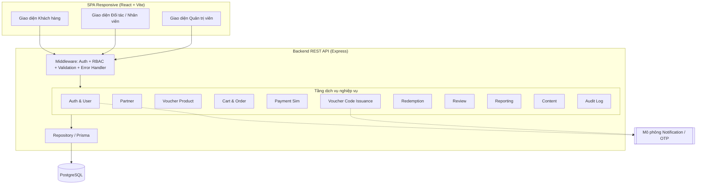
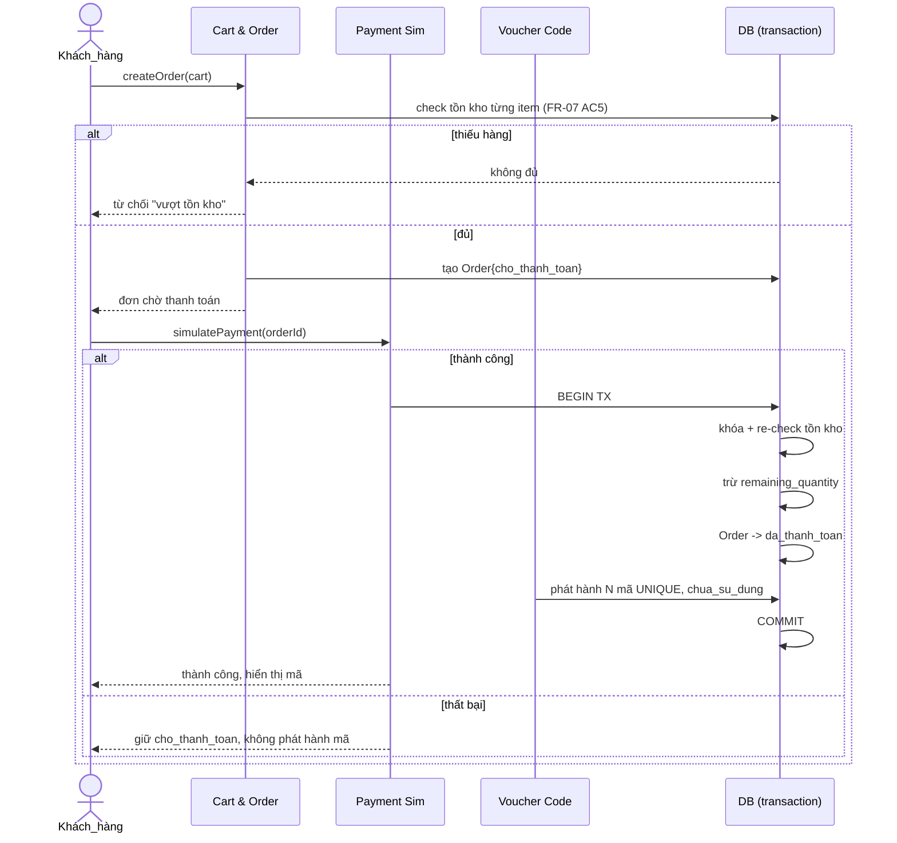

# Kiến trúc hệ thống — Architecture

> Hệ thống Thương mại điện tử bán Voucher (Hệ_thống)
> Nguồn: `docs/02-srs/`. 

## 1. Tổng quan

Hệ_thống là sàn trung gian ba vai trò theo kiến trúc **client–server nhiều tầng (layered)**: một SPA responsive gọi REST API; backend tách logic theo module dịch vụ; dữ liệu lưu trong CSDL quan hệ với transaction ACID. Các bất biến nghiệp vụ giá trị cao (mã duy nhất, chống oversell, không lộ mã trước thanh toán, RBAC) được bảo đảm ở tầng service + ràng buộc DB.

## 2. Ngăn xếp công nghệ (Technology Stack)

| Thành phần | Lựa chọn | Vai trò |
| --- | --- | --- |
| Ngôn ngữ | **TypeScript** | Một ngôn ngữ cho cả FE/BE, gõ tĩnh giảm lỗi |
| Backend | **Express** (Node.js) | REST API, middleware Auth/RBAC/validation/error |
| CSDL | **PostgreSQL** | Giao dịch ACID, khóa hàng chống oversell |
| ORM | **Prisma** | Migration type-safe, transaction rõ ràng |
| Frontend | **React + Vite** | SPA responsive |
| Xác thực | **JWT + bcrypt** | Phiên không trạng thái, băm mật khẩu |
| Sinh mã | **`crypto.randomBytes`** (CSPRNG) | Voucher_code khó đoán |
| Validation | **Zod** | Kiểm tra đầu vào tại boundary |
| Test | **Vitest + fast-check** | Unit + property-based testing |
| Monorepo | **npm workspaces** | `backend` / `frontend` / `shared` |

> Stack này đã được hiện thực trong scaffold (`backend/`, `frontend/`, `shared/`).

## 3. Sơ đồ thành phần

## 4. Tầng kiến trúc

| Tầng | Trách nhiệm |
| --- | --- |
| **Presentation (SPA)** | Render UI 3 vai trò; không chứa logic nghiệp vụ nhạy cảm |
| **API / Controller** | Định tuyến HTTP, validate đầu vào (Zod), ánh xạ request → service |
| **Middleware** | Xác thực JWT, RBAC, kiểm tra phạm vi sở hữu, error handler tập trung, ghi audit |
| **Service (Domain)** | Logic thuần: máy trạng thái, tồn kho, phát hành mã, xác thực — nơi tập trung correctness |
| **Repository (Prisma)** | Truy vấn + transaction với DB |
| **Database** | Lưu bền vững dữ liệu nghiệp vụ |

## 5. Luồng dữ liệu lõi: Mua → Thanh toán → Phát hành mã

Thực hiện trong **một transaction nguyên tử** để chống oversell và bảo đảm chỉ phát hành mã sau thanh toán (FLOW-003, FR-08).

## 6. Cross-cutting concerns

| Concern | Cách xử lý | SRS/NFR |
| --- | --- | --- |
| **Xác thực** | JWT bearer; phiên không trạng thái; băm mật khẩu bcrypt | FR-02, NFR-02 |
| **Phân quyền (RBAC)** | Middleware kiểm tra vai trò + phạm vi sở hữu trước service | FR-03, NFR-02 |
| **Validation** | Zod tại route boundary trước khi tới service | api-conventions |
| **Xử lý lỗi** | Error middleware tập trung → wrapper `{success:false,error}` | NFR-03 |
| **Transaction** | Mọi thao tác đa bước dùng `prisma.$transaction` | NFR-03 |
| **Chống oversell** | `SELECT ... FOR UPDATE` / cập nhật điều kiện `WHERE remaining >= qty` | FR-07/08 |
| **Mã duy nhất** | CSPRNG + ràng buộc UNIQUE ở DB + retry khi đụng độ | FR-08 |
| **Audit** | Audit Service ghi nhật ký thao tác quản trị quan trọng | FR-23, NFR-07 |
| **Bảo mật mã** | Không trả Voucher_code khi đơn chưa `da_thanh_toan` | FR-08 AC8 |

## 7. Các lựa chọn kiến trúc lớn (≥2 phương án)

### 7.1 Tổ chức backend

**Option A — Layered services trong một Express app (monolith module hóa)**
- **Approach**: các service theo domain trong một process; middleware chung.
- **Pros**: đơn giản, dễ transaction xuyên service, phù hợp đồ án; deploy một đơn vị.
- **Cons**: không scale độc lập từng service.
- **Effort**: low · **Risk**: low

**Option B — Microservices**
- **Approach**: tách service thành process/triển khai riêng.
- **Pros**: scale độc lập, ranh giới rõ.
- **Cons**: transaction phân tán phức tạp (saga), vận hành nặng, quá mức cho demo.
- **Effort**: high · **Risk**: high

**→ Recommendation: A** — phạm vi đồ án (CON-05) + nhu cầu transaction nguyên tử xuyên service (phát hành mã) khiến monolith module hóa là lựa chọn đúng đắn và ít rủi ro.

### 7.2 Xác thực

**Option A — JWT (stateless)**
- **Pros**: không cần lưu phiên server, đơn giản cho SPA + REST.
- **Cons**: thu hồi token tức thì khó (chấp nhận được ở demo).
- **Effort**: low · **Risk**: low

**Option B — Session cookie + store (Redis)**
- **Pros**: thu hồi phiên tức thì.
- **Cons**: thêm hạ tầng (Redis), nặng hơn nhu cầu.
- **Effort**: med · **Risk**: med

**→ Recommendation: A** — JWT + bcrypt đủ cho NFR-02, không thêm hạ tầng.

## 8. Trade-offs & Future

- **Monolith**: đánh đổi khả năng scale độc lập lấy sự đơn giản — đúng cho MVP/đồ án. Khi cần, các service đã tách module nên có thể tách process sau.
- **JWT**: đánh đổi thu hồi tức thì lấy stateless. Tương lai có thể thêm refresh-token blocklist.
- **Tương lai**: tích hợp thanh toán thật (thay Payment Sim), thông báo thật (thay mô phỏng), cache đọc cho danh sách voucher nếu tải tăng.
