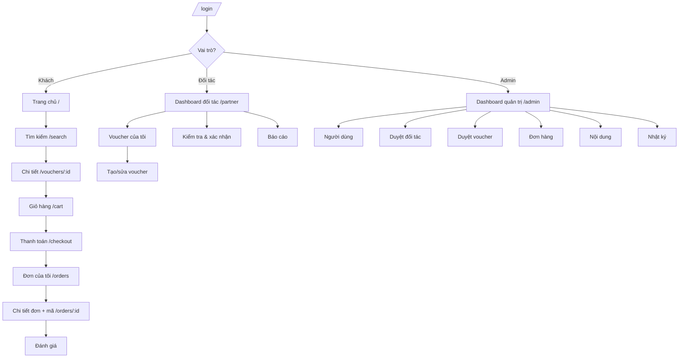

# Thiết kế Frontend (Frontend Design)

> SPA responsive — React + Vite, 3 vai trò (Khách_hàng, Đối_tác/Nhân_viên, Quản_trị_viên).
> Nguồn: `docs/02-srs/` (FR/FLOW), `docs/07-api-design/`. Selectors dùng `data-testid` để E2E (`docs/09-testing/`) bám theo.

## 1. Nguyên tắc thiết kế

- **Responsive-first** (NFR-05): mọi màn hình dùng trên desktop + mobile; layout co theo breakpoint.
- **Phân vùng theo vai trò**: 3 khu vực `/` (khách), `/partner` (đối tác), `/admin` (quản trị); route guard theo RBAC (FR-03).
- **Wrapper-aware**: mọi gọi API kiểm tra `success` trước khi đọc `data`.
- **Không lộ dữ liệu nhạy cảm**: voucher code chỉ render sau khi đơn `da_thanh_toan` (FR-08 AC8).
- **Trạng thái tường minh**: mỗi màn hình data-driven phải xử lý đủ loading / empty / error / success.

## 2. Lựa chọn thiết kế

### Option A: Tách 3 app theo vai trò (3 build riêng)
**Approach**: mỗi vai trò một bundle Vite độc lập. **Pros**: tách bạch tuyệt đối, bundle nhỏ. **Cons**: trùng lặp component dùng chung, 3 pipeline build, phức tạp cho đồ án. **Effort**: cao · **Risk**: trung bình.

### Option B: Một SPA, phân vùng route theo vai trò
**Approach**: một app React, route group `/`, `/partner`, `/admin`, dùng chung component lib + route guard RBAC. **Pros**: chia sẻ component, một build, đơn giản, đúng quy mô đồ án. **Cons**: bundle lớn hơn (giảm bằng lazy-load theo route group). **Effort**: thấp · **Risk**: thấp.

### Recommendation: **Option B**
**Reason**: quy mô đồ án (CON-05) ưu tiên đơn giản + tái dùng; lazy-load theo nhóm route đủ giải quyết kích thước bundle. Khớp scaffold `frontend/` hiện có (một Vite app).

## 3. Danh mục màn hình (Screen Inventory)

### Chung / Xác thực
| Màn hình | Route | FR/FLOW | Vai trò |
| --- | --- | --- | --- |
| Đăng ký | `/register` | FR-01 / FLOW-001 | Khách (+ Đối tác) |
| Đăng nhập | `/login` | FR-02 / FLOW-001 | Mọi vai trò |
| Quên / đổi mật khẩu | `/forgot-password`, `/profile/password` | FR-02 | Đã đăng nhập |
| Hồ sơ cá nhân | `/profile` | FR-02 | Đã đăng nhập |

### Khách hàng
| Màn hình | Route | FR/FLOW |
| --- | --- | --- |
| Trang chủ / danh sách voucher | `/` | FR-04 / FLOW-002 |
| Kết quả tìm kiếm + bộ lọc | `/search` | FR-04 / FLOW-002 |
| Chi tiết voucher | `/vouchers/:id` | FR-05 / FLOW-002 |
| Giỏ hàng | `/cart` | FR-06 / FLOW-003 |
| Thanh toán (checkout) | `/checkout` | FR-07, FR-08 / FLOW-003 |
| Đơn hàng của tôi | `/orders` | FR-09 / FLOW-003 |
| Chi tiết đơn + mã voucher | `/orders/:id` | FR-09 / FLOW-003 |
| Gửi đánh giá | `/vouchers/:id/review` | FR-10 / FLOW-004 |

### Đối tác / Nhân viên
| Màn hình | Route | FR/FLOW |
| --- | --- | --- |
| Đăng ký đối tác | `/partner/register` | FR-11 / FLOW-005 |
| Dashboard đối tác | `/partner` | FR-16 / FLOW-008 |
| Hồ sơ + chi nhánh | `/partner/profile` | FR-11 |
| Danh sách voucher của tôi | `/partner/vouchers` | FR-12 / FLOW-006 |
| Tạo / sửa voucher | `/partner/vouchers/new`, `/partner/vouchers/:id/edit` | FR-12, FR-13 / FLOW-006 |
| Kiểm tra & xác nhận sử dụng | `/partner/redeem` | FR-14, FR-15 / FLOW-007 |
| Báo cáo đối tác | `/partner/reports` | FR-16 / FLOW-008 |

### Quản trị viên
| Màn hình | Route | FR/FLOW |
| --- | --- | --- |
| Dashboard quản trị | `/admin` | FR-22 / FLOW-011 |
| Quản lý người dùng | `/admin/users` | FR-17 / FLOW-009 |
| Quản lý đối tác (duyệt) | `/admin/partners` | FR-18 / FLOW-005 |
| Duyệt voucher | `/admin/vouchers` | FR-19 / FLOW-006 |
| Quản lý đơn hàng | `/admin/orders` | FR-20 / FLOW-010 |
| Quản lý nội dung | `/admin/content` | FR-21 / FLOW-011 |
| Nhật ký hệ thống | `/admin/audit-logs` | FR-23 / FLOW-012 |

## 4. Sơ đồ điều hướng

## 5. Spec component theo màn hình (chính)

> Mỗi phần tử tương tác có `data-testid` để E2E selector ổn định (ưu tiên 1 theo `testing.md`).

### Chi tiết voucher `/vouchers/:id` (FR-05)
| Component | data-testid | Ghi chú |
| --- | --- | --- |
| Tên + ảnh | `voucher-title`, `voucher-image` | |
| Giá gốc / giá bán | `voucher-original-price`, `voucher-sale-price` | hiển thị % giảm |
| Điều kiện + thời hạn + chi nhánh | `voucher-terms`, `voucher-usage-period`, `voucher-branches` | |
| Số lượng còn lại | `voucher-remaining` | =0 → badge "Hết hàng" |
| Nút thêm giỏ | `add-to-cart-btn` | disabled khi `remaining=0` (AC2) |

### Giỏ hàng `/cart` (FR-06)
| Component | data-testid | Ghi chú |
| --- | --- | --- |
| Dòng mục giỏ | `cart-item-:id` | |
| Sửa số lượng | `cart-qty-:id` | nguyên dương; >tồn kho → lỗi inline (AC5) |
| Xóa mục | `cart-remove-:id` | |
| Tổng tạm tính | `cart-subtotal` | Σ(giá×SL) (AC4) |
| Nút đặt đơn | `checkout-btn` | disabled khi giỏ rỗng |

### Thanh toán `/checkout` (FR-07, FR-08)
| Component | data-testid | Ghi chú |
| --- | --- | --- |
| Chọn quà tặng + người nhận | `gift-toggle`, `gift-recipient` | tùy chọn (AC2) |
| Phương thức thanh toán mô phỏng | `payment-method` | |
| Nút thanh toán | `pay-btn` | → loading trong khi TX |
| Kết quả + danh sách mã | `payment-result`, `voucher-code-:id` | mã chỉ hiện khi `da_thanh_toan` (AC8) |
| Thông báo lỗi tồn kho | `oversell-error` | khi AC5/AC7 |

### Xác nhận sử dụng `/partner/redeem` (FR-14, FR-15)
| Component | data-testid | Ghi chú |
| --- | --- | --- |
| Ô nhập mã / quét QR | `redeem-code-input`, `scan-qr-btn` | |
| Kết quả kiểm tra | `code-status` | hợp lệ / không tồn tại / ngoài phạm vi |
| Nút xác nhận sử dụng | `confirm-redeem-btn` | disabled nếu mã không hợp lệ |
| Thông báo kết quả | `redeem-result` | thành công / từ chối + lý do |

### Duyệt voucher `/admin/vouchers` (FR-19)
| Component | data-testid | Ghi chú |
| --- | --- | --- |
| Hàng voucher chờ duyệt | `voucher-row-:id` | |
| Duyệt / từ chối / công bố / tạm ngưng | `approve-btn`, `reject-btn`, `publish-btn`, `suspend-btn` | từ chối yêu cầu lý do |
| Ô lý do từ chối | `reject-reason` | |

## 6. Checklist trạng thái component (data-driven)

Mỗi màn hình gọi API phải xử lý đủ:

- [ ] **Loading** — skeleton / spinner trong khi chờ.
- [ ] **Empty** — danh sách rỗng kèm thông báo (vd FR-04 AC4 "không có kết quả").
- [ ] **Error** — wrapper `success:false` → hiển thị `error` thân thiện, không lộ stack.
- [ ] **Success** — render `data`.
- [ ] **Forbidden** — 401 → chuyển `/login`; 403 → trang "không đủ quyền" (FR-03).

## 7. Accessibility (NFR-05)

- Mỗi input có `<label>` liên kết; nút icon có `aria-label`.
- Tương phản màu đạt WCAG AA; không chỉ dùng màu để truyền trạng thái (kèm text/icon).
- Điều hướng được bằng bàn phím; focus ring rõ ràng; thứ tự tab hợp lý.
- Thông báo lỗi/thành công đặt trong `aria-live` để screen reader đọc.
- Touch target ≥ 44×44px trên mobile.
- Lưu ý: tuân thủ WCAG đầy đủ cần kiểm thử thủ công với assistive technology — đây là baseline thiết kế, không thay thế kiểm định.

## 8. Truy vết màn hình ↔ FR/FLOW

| Nhóm | Màn hình | FR | FLOW |
| --- | --- | --- | --- |
| Auth | register, login, profile | FR-01..03 | FLOW-001 |
| Khách | home, search, detail, cart, checkout, orders, review | FR-04..10 | FLOW-002..004 |
| Đối tác | register, vouchers, editor, redeem, reports | FR-11..16 | FLOW-005..008 |
| Admin | dashboard, users, partners, vouchers, orders, content, logs | FR-17..23 | FLOW-009..012 |
